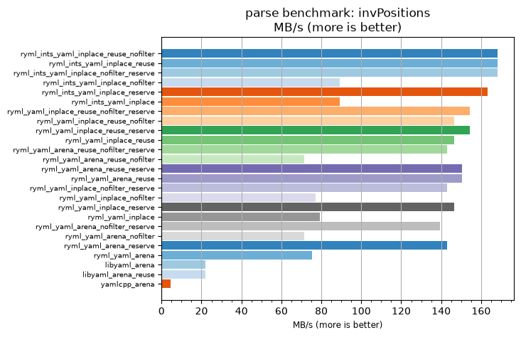
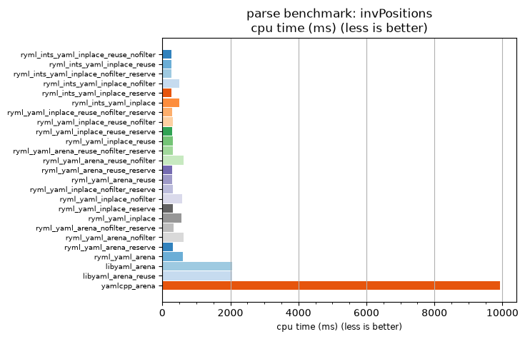

## parse benchmark: invPositions

<p>Data type benchmark results:</p>
<ul>
   <li><pre><a href='#ryml-bm-parse-invPositions-ryml_ints_yaml_inplace_reuse_nofilter'>ryml_ints_yaml_inplace_reuse_nofilter</a></pre></li> </ul>


<br/>
<br/>

---

<a id="ryml-bm-parse-invPositions-ryml_ints_yaml_inplace_reuse_nofilter"/>

### parse benchmark: invPositions

* Interactive html graphs
  * [MB/s](./ryml-bm-parse-invPositions-mega_bytes_per_second.html)
  * [CPU time](./ryml-bm-parse-invPositions-cpu_time_ms.html)

[](./ryml-bm-parse-invPositions-mega_bytes_per_second.png)
[](./ryml-bm-parse-invPositions-cpu_time_ms.png)

```
+---------------------------------------------------------------------------------------------------------------------+
|                                            parse benchmark: invPositions                                            |
+------------------------------------------+---------+---------+----------+---------------+-------------+-------------+
| function                                 |    MB/s | MB/s(x) |  MB/s(%) | cpu time (ms) | cpu time(x) | cpu time(%) |
+------------------------------------------+---------+---------+----------+---------------+-------------+-------------+
| ryml_ints_yaml_inplace_reuse_nofilter    |  168.11 |  37.35x | 3635.29% |        265.62 |       0.03x |     -97.32% |
| ryml_ints_yaml_inplace_reuse             |  168.11 |  37.35x | 3635.29% |        265.62 |       0.03x |     -97.32% |
| ryml_ints_yaml_inplace_nofilter_reserve  |  168.11 |  37.35x | 3635.29% |        265.62 |       0.03x |     -97.32% |
| ryml_ints_yaml_inplace_nofilter          |   89.31 |  19.84x | 1884.38% |        500.00 |       0.05x |     -94.96% |
| ryml_ints_yaml_inplace_reserve           |  163.30 |  36.29x | 3528.57% |        273.44 |       0.03x |     -97.24% |
| ryml_ints_yaml_inplace                   |   89.31 |  19.84x | 1884.38% |        500.00 |       0.05x |     -94.96% |
| ryml_yaml_inplace_reuse_nofilter_reserve |  154.48 |  34.32x | 3332.43% |        289.06 |       0.03x |     -97.09% |
| ryml_yaml_inplace_reuse_nofilter         |  146.55 |  32.56x | 3156.41% |        304.69 |       0.03x |     -96.93% |
| ryml_yaml_inplace_reuse_reserve          |  154.48 |  34.32x | 3332.43% |        289.06 |       0.03x |     -97.09% |
| ryml_yaml_inplace_reuse                  |  146.55 |  32.56x | 3156.41% |        304.69 |       0.03x |     -96.93% |
| ryml_yaml_arena_reuse_nofilter_reserve   |  142.89 |  31.75x | 3075.00% |        312.50 |       0.03x |     -96.85% |
| ryml_yaml_arena_reuse_nofilter           |   71.45 |  15.88x | 1487.50% |        625.00 |       0.06x |     -93.70% |
| ryml_yaml_arena_reuse_reserve            |  150.41 |  33.42x | 3242.11% |        296.88 |       0.03x |     -97.01% |
| ryml_yaml_arena_reuse                    |  150.41 |  33.42x | 3242.11% |        296.88 |       0.03x |     -97.01% |
| ryml_yaml_inplace_nofilter_reserve       |  142.89 |  31.75x | 3075.00% |        312.50 |       0.03x |     -96.85% |
| ryml_yaml_inplace_nofilter               |   77.24 |  17.16x | 1616.22% |        578.12 |       0.06x |     -94.17% |
| ryml_yaml_inplace_reserve                |  146.55 |  32.56x | 3156.41% |        304.69 |       0.03x |     -96.93% |
| ryml_yaml_inplace                        |   79.38 |  17.64x | 1663.89% |        562.50 |       0.06x |     -94.33% |
| ryml_yaml_arena_nofilter_reserve         |  139.41 |  30.98x | 2997.56% |        320.31 |       0.03x |     -96.77% |
| ryml_yaml_arena_nofilter                 |   71.45 |  15.88x | 1487.50% |        625.00 |       0.06x |     -93.70% |
| ryml_yaml_arena_reserve                  |  142.89 |  31.75x | 3075.00% |        312.50 |       0.03x |     -96.85% |
| ryml_yaml_arena                          |   75.21 |  16.71x | 1571.05% |        593.75 |       0.06x |     -94.02% |
| libyaml_arena                            |   21.82 |   4.85x |  384.73% |       2046.88 |       0.21x |     -79.37% |
| libyaml_arena_reuse                      |   21.82 |   4.85x |  384.73% |       2046.88 |       0.21x |     -79.37% |
| yamlcpp_arena                            |    4.50 |   1.00x |    0.00% |       9921.88 |       1.00x |       0.00% |
+------------------------------------------+---------+---------+----------+---------------+-------------+-------------+
```

