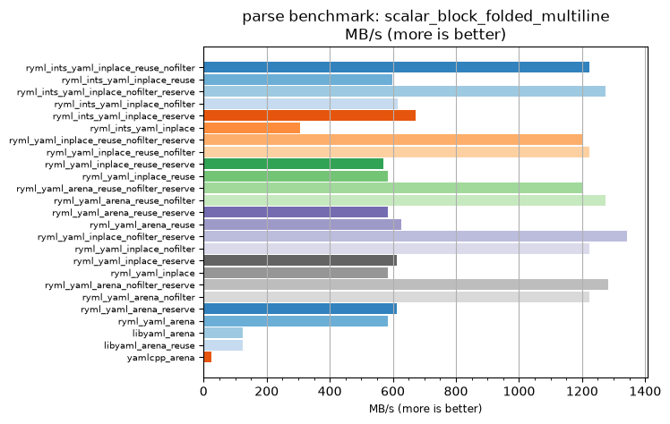
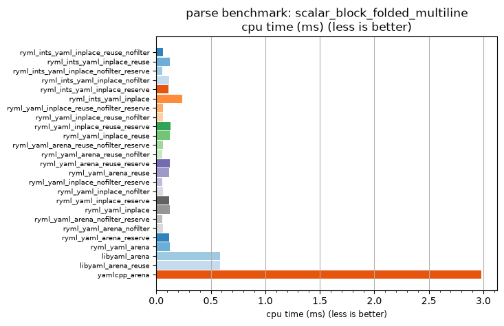

## parse benchmark: scalar_block_folded_multiline

<p>Data type benchmark results:</p>
<ul>
   <li><pre><a href='#ryml-bm-parse-scalar_block_folded_multiline-ryml_ints_yaml_inplace_reuse_nofilter'>ryml_ints_yaml_inplace_reuse_nofilter</a></pre></li> </ul>


<br/>
<br/>

---

<a id="ryml-bm-parse-scalar_block_folded_multiline-ryml_ints_yaml_inplace_reuse_nofilter"/>

### parse benchmark: scalar_block_folded_multiline

* Interactive html graphs
  * [MB/s](./ryml-bm-parse-scalar_block_folded_multiline-mega_bytes_per_second.html)
  * [CPU time](./ryml-bm-parse-scalar_block_folded_multiline-cpu_time_ms.html)

[](./ryml-bm-parse-scalar_block_folded_multiline-mega_bytes_per_second.png)
[](./ryml-bm-parse-scalar_block_folded_multiline-cpu_time_ms.png)

```
+---------------------------------------------------------------------------------------------------------------------+
|                                    parse benchmark: scalar_block_folded_multiline                                   |
+------------------------------------------+---------+---------+----------+---------------+-------------+-------------+
| function                                 |    MB/s | MB/s(x) |  MB/s(%) | cpu time (ms) | cpu time(x) | cpu time(%) |
+------------------------------------------+---------+---------+----------+---------------+-------------+-------------+
| ryml_ints_yaml_inplace_reuse_nofilter    | 1222.83 |  49.66x | 4866.50% |          0.06 |       0.02x |     -97.99% |
| ryml_ints_yaml_inplace_reuse             |  597.52 |  24.27x | 2326.81% |          0.12 |       0.04x |     -95.88% |
| ryml_ints_yaml_inplace_nofilter_reserve  | 1274.70 |  51.77x | 5077.20% |          0.06 |       0.02x |     -98.07% |
| ryml_ints_yaml_inplace_nofilter          |  615.02 |  24.98x | 2397.88% |          0.12 |       0.04x |     -96.00% |
| ryml_ints_yaml_inplace_reserve           |  671.35 |  27.27x | 2626.69% |          0.11 |       0.04x |     -96.33% |
| ryml_ints_yaml_inplace                   |  304.85 |  12.38x | 1138.16% |          0.24 |       0.08x |     -91.92% |
| ryml_yaml_inplace_reuse_nofilter_reserve | 1201.86 |  48.81x | 4781.36% |          0.06 |       0.02x |     -97.95% |
| ryml_yaml_inplace_reuse_nofilter         | 1222.83 |  49.66x | 4866.50% |          0.06 |       0.02x |     -97.99% |
| ryml_yaml_inplace_reuse_reserve          |  570.02 |  23.15x | 2215.11% |          0.13 |       0.04x |     -95.68% |
| ryml_yaml_inplace_reuse                  |  584.24 |  23.73x | 2272.88% |          0.13 |       0.04x |     -95.79% |
| ryml_yaml_arena_reuse_nofilter_reserve   | 1203.79 |  48.89x | 4789.18% |          0.06 |       0.02x |     -97.95% |
| ryml_yaml_arena_reuse_nofilter           | 1274.70 |  51.77x | 5077.20% |          0.06 |       0.02x |     -98.07% |
| ryml_yaml_arena_reuse_reserve            |  584.24 |  23.73x | 2272.88% |          0.13 |       0.04x |     -95.79% |
| ryml_yaml_arena_reuse                    |  625.97 |  25.42x | 2442.37% |          0.12 |       0.04x |     -96.07% |
| ryml_yaml_inplace_nofilter_reserve       | 1341.37 |  54.48x | 5347.94% |          0.05 |       0.02x |     -98.16% |
| ryml_yaml_inplace_nofilter               | 1222.83 |  49.66x | 4866.50% |          0.06 |       0.02x |     -97.99% |
| ryml_yaml_inplace_reserve                |  611.41 |  24.83x | 2383.25% |          0.12 |       0.04x |     -95.97% |
| ryml_yaml_inplace                        |  584.27 |  23.73x | 2272.99% |          0.13 |       0.04x |     -95.79% |
| ryml_yaml_arena_nofilter_reserve         | 1282.48 |  52.09x | 5108.76% |          0.06 |       0.02x |     -98.08% |
| ryml_yaml_arena_nofilter                 | 1222.83 |  49.66x | 4866.50% |          0.06 |       0.02x |     -97.99% |
| ryml_yaml_arena_reserve                  |  613.20 |  24.90x | 2390.49% |          0.12 |       0.04x |     -95.98% |
| ryml_yaml_arena                          |  584.24 |  23.73x | 2272.88% |          0.13 |       0.04x |     -95.79% |
| libyaml_arena                            |  125.19 |   5.08x |  408.47% |          0.59 |       0.20x |     -80.33% |
| libyaml_arena_reuse                      |  125.19 |   5.08x |  408.47% |          0.59 |       0.20x |     -80.33% |
| yamlcpp_arena                            |   24.62 |   1.00x |    0.00% |          2.98 |       1.00x |       0.00% |
+------------------------------------------+---------+---------+----------+---------------+-------------+-------------+
```

