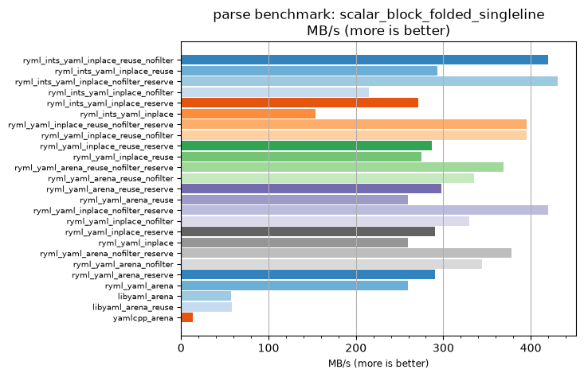
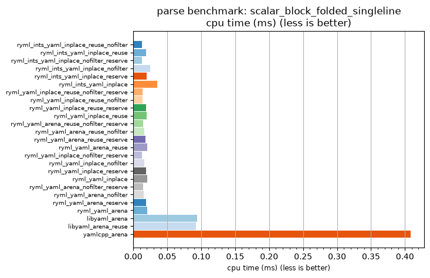

## parse benchmark: scalar_block_folded_singleline

<p>Data type benchmark results:</p>
<ul>
   <li><pre><a href='#ryml-bm-parse-scalar_block_folded_singleline-ryml_ints_yaml_inplace_reuse_nofilter'>ryml_ints_yaml_inplace_reuse_nofilter</a></pre></li> </ul>


<br/>
<br/>

---

<a id="ryml-bm-parse-scalar_block_folded_singleline-ryml_ints_yaml_inplace_reuse_nofilter"/>

### parse benchmark: scalar_block_folded_singleline

* Interactive html graphs
  * [MB/s](./ryml-bm-parse-scalar_block_folded_singleline-mega_bytes_per_second.html)
  * [CPU time](./ryml-bm-parse-scalar_block_folded_singleline-cpu_time_ms.html)

[](./ryml-bm-parse-scalar_block_folded_singleline-mega_bytes_per_second.png)
[](./ryml-bm-parse-scalar_block_folded_singleline-cpu_time_ms.png)

```
+---------------------------------------------------------------------------------------------------------------------+
|                                   parse benchmark: scalar_block_folded_singleline                                   |
+------------------------------------------+---------+---------+----------+---------------+-------------+-------------+
| function                                 |    MB/s | MB/s(x) |  MB/s(%) | cpu time (ms) | cpu time(x) | cpu time(%) |
+------------------------------------------+---------+---------+----------+---------------+-------------+-------------+
| ryml_ints_yaml_inplace_reuse_nofilter    |  420.06 |  31.71x | 3070.89% |          0.01 |       0.03x |     -96.85% |
| ryml_ints_yaml_inplace_reuse             |  293.56 |  22.16x | 2115.99% |          0.02 |       0.05x |     -95.49% |
| ryml_ints_yaml_inplace_nofilter_reserve  |  430.56 |  32.50x | 3150.16% |          0.01 |       0.03x |     -96.92% |
| ryml_ints_yaml_inplace_nofilter          |  215.28 |  16.25x | 1525.07% |          0.03 |       0.06x |     -93.85% |
| ryml_ints_yaml_inplace_reserve           |  270.98 |  20.46x | 1945.57% |          0.02 |       0.05x |     -95.11% |
| ryml_ints_yaml_inplace                   |  153.77 |  11.61x | 1060.79% |          0.04 |       0.09x |     -91.39% |
| ryml_yaml_inplace_reuse_nofilter_reserve |  395.41 |  29.85x | 2884.83% |          0.01 |       0.03x |     -96.65% |
| ryml_yaml_inplace_reuse_nofilter         |  395.41 |  29.85x | 2884.83% |          0.01 |       0.03x |     -96.65% |
| ryml_yaml_inplace_reuse_reserve          |  287.04 |  21.67x | 2066.76% |          0.02 |       0.05x |     -95.38% |
| ryml_yaml_inplace_reuse                  |  274.82 |  20.75x | 1974.54% |          0.02 |       0.05x |     -95.18% |
| ryml_yaml_arena_reuse_nofilter_reserve   |  369.05 |  27.86x | 2685.84% |          0.01 |       0.04x |     -96.41% |
| ryml_yaml_arena_reuse_nofilter           |  335.50 |  25.33x | 2432.56% |          0.02 |       0.04x |     -96.05% |
| ryml_yaml_arena_reuse_reserve            |  298.08 |  22.50x | 2150.10% |          0.02 |       0.04x |     -95.56% |
| ryml_yaml_arena_reuse                    |  259.20 |  19.57x | 1856.64% |          0.02 |       0.05x |     -94.89% |
| ryml_yaml_inplace_nofilter_reserve       |  420.06 |  31.71x | 3070.89% |          0.01 |       0.03x |     -96.85% |
| ryml_yaml_inplace_nofilter               |  329.79 |  24.89x | 2389.47% |          0.02 |       0.04x |     -95.98% |
| ryml_yaml_inplace_reserve                |  290.81 |  21.95x | 2095.25% |          0.02 |       0.05x |     -95.44% |
| ryml_yaml_inplace                        |  259.20 |  19.57x | 1856.64% |          0.02 |       0.05x |     -94.89% |
| ryml_yaml_arena_nofilter_reserve         |  378.05 |  28.54x | 2753.79% |          0.01 |       0.04x |     -96.50% |
| ryml_yaml_arena_nofilter                 |  344.45 |  26.00x | 2500.12% |          0.02 |       0.04x |     -96.15% |
| ryml_yaml_arena_reserve                  |  290.81 |  21.95x | 2095.25% |          0.02 |       0.05x |     -95.44% |
| ryml_yaml_arena                          |  259.20 |  19.57x | 1856.64% |          0.02 |       0.05x |     -94.89% |
| libyaml_arena                            |   57.41 |   4.33x |  333.37% |          0.09 |       0.23x |     -76.93% |
| libyaml_arena_reuse                      |   58.49 |   4.42x |  341.53% |          0.09 |       0.23x |     -77.35% |
| yamlcpp_arena                            |   13.25 |   1.00x |    0.00% |          0.41 |       1.00x |       0.00% |
+------------------------------------------+---------+---------+----------+---------------+-------------+-------------+
```

