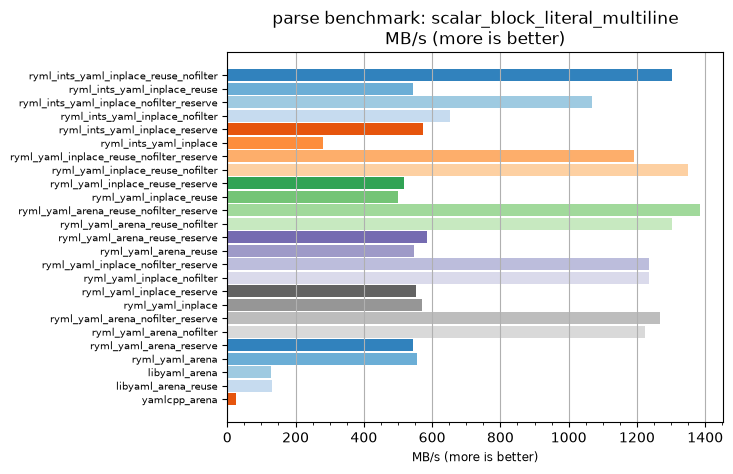
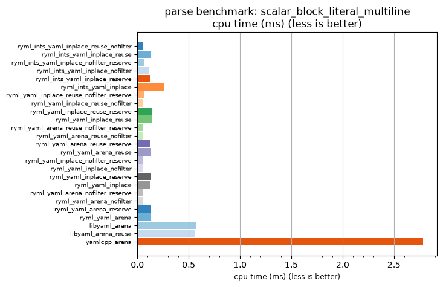

## parse benchmark: scalar_block_literal_multiline

<p>Data type benchmark results:</p>
<ul>
   <li><pre><a href='#ryml-bm-parse-scalar_block_literal_multiline-ryml_ints_yaml_inplace_reuse_nofilter'>ryml_ints_yaml_inplace_reuse_nofilter</a></pre></li> </ul>


<br/>
<br/>

---

<a id="ryml-bm-parse-scalar_block_literal_multiline-ryml_ints_yaml_inplace_reuse_nofilter"/>

### parse benchmark: scalar_block_literal_multiline

* Interactive html graphs
  * [MB/s](./ryml-bm-parse-scalar_block_literal_multiline-mega_bytes_per_second.html)
  * [CPU time](./ryml-bm-parse-scalar_block_literal_multiline-cpu_time_ms.html)

[](./ryml-bm-parse-scalar_block_literal_multiline-mega_bytes_per_second.png)
[](./ryml-bm-parse-scalar_block_literal_multiline-cpu_time_ms.png)

```
+---------------------------------------------------------------------------------------------------------------------+
|                                   parse benchmark: scalar_block_literal_multiline                                   |
+------------------------------------------+---------+---------+----------+---------------+-------------+-------------+
| function                                 |    MB/s | MB/s(x) |  MB/s(%) | cpu time (ms) | cpu time(x) | cpu time(%) |
+------------------------------------------+---------+---------+----------+---------------+-------------+-------------+
| ryml_ints_yaml_inplace_reuse_nofilter    | 1304.11 |  49.45x | 4845.29% |          0.06 |       0.02x |     -97.98% |
| ryml_ints_yaml_inplace_reuse             |  543.50 |  20.61x | 1961.01% |          0.13 |       0.05x |     -95.15% |
| ryml_ints_yaml_inplace_nofilter_reserve  | 1067.00 |  40.46x | 3946.14% |          0.07 |       0.02x |     -97.53% |
| ryml_ints_yaml_inplace_nofilter          |  653.19 |  24.77x | 2376.94% |          0.11 |       0.04x |     -95.96% |
| ryml_ints_yaml_inplace_reserve           |  574.69 |  21.79x | 2079.27% |          0.13 |       0.05x |     -95.41% |
| ryml_ints_yaml_inplace                   |  281.15 |  10.66x |  966.16% |          0.26 |       0.09x |     -90.62% |
| ryml_yaml_inplace_reuse_nofilter_reserve | 1192.01 |  45.20x | 4420.22% |          0.06 |       0.02x |     -97.79% |
| ryml_yaml_inplace_reuse_nofilter         | 1348.25 |  51.13x | 5012.67% |          0.05 |       0.02x |     -98.04% |
| ryml_yaml_inplace_reuse_reserve          |  518.05 |  19.64x | 1864.47% |          0.14 |       0.05x |     -94.91% |
| ryml_yaml_inplace_reuse                  |  500.78 |  18.99x | 1798.99% |          0.15 |       0.05x |     -94.73% |
| ryml_yaml_arena_reuse_nofilter_reserve   | 1383.73 |  52.47x | 5147.21% |          0.05 |       0.02x |     -98.09% |
| ryml_yaml_arena_reuse_nofilter           | 1304.11 |  49.45x | 4845.29% |          0.06 |       0.02x |     -97.98% |
| ryml_yaml_arena_reuse_reserve            |  584.27 |  22.16x | 2115.59% |          0.13 |       0.05x |     -95.49% |
| ryml_yaml_arena_reuse                    |  547.68 |  20.77x | 1976.83% |          0.13 |       0.05x |     -95.18% |
| ryml_yaml_inplace_nofilter_reserve       | 1235.47 |  46.85x | 4585.01% |          0.06 |       0.02x |     -97.87% |
| ryml_yaml_inplace_nofilter               | 1235.47 |  46.85x | 4585.01% |          0.06 |       0.02x |     -97.87% |
| ryml_yaml_inplace_reserve                |  553.49 |  20.99x | 1998.88% |          0.13 |       0.05x |     -95.24% |
| ryml_yaml_inplace                        |  571.54 |  21.67x | 2067.33% |          0.13 |       0.05x |     -95.39% |
| ryml_yaml_arena_nofilter_reserve         | 1268.86 |  48.12x | 4711.63% |          0.06 |       0.02x |     -97.92% |
| ryml_yaml_arena_nofilter                 | 1222.83 |  46.37x | 4537.07% |          0.06 |       0.02x |     -97.84% |
| ryml_yaml_arena_reserve                  |  543.50 |  20.61x | 1961.01% |          0.13 |       0.05x |     -95.15% |
| ryml_yaml_arena                          |  556.44 |  21.10x | 2010.08% |          0.13 |       0.05x |     -95.26% |
| libyaml_arena                            |  126.89 |   4.81x |  381.16% |          0.58 |       0.21x |     -79.22% |
| libyaml_arena_reuse                      |  131.45 |   4.98x |  398.48% |          0.56 |       0.20x |     -79.94% |
| yamlcpp_arena                            |   26.37 |   1.00x |    0.00% |          2.78 |       1.00x |       0.00% |
+------------------------------------------+---------+---------+----------+---------------+-------------+-------------+
```

