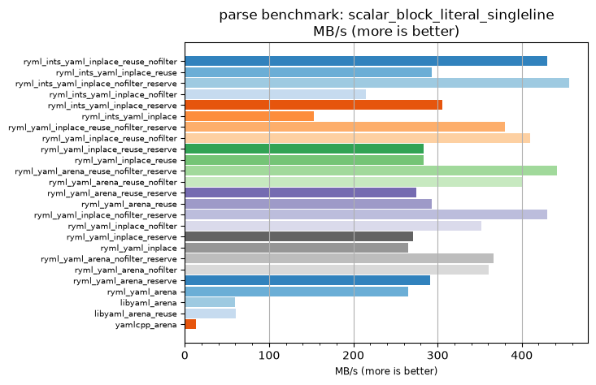
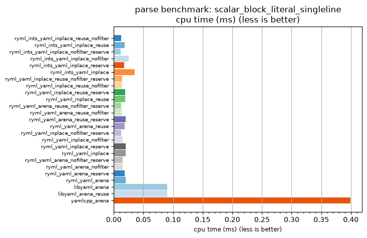

## parse benchmark: scalar_block_literal_singleline

<p>Data type benchmark results:</p>
<ul>
   <li><pre><a href='#ryml-bm-parse-scalar_block_literal_singleline-ryml_ints_yaml_inplace_reuse_nofilter'>ryml_ints_yaml_inplace_reuse_nofilter</a></pre></li> </ul>


<br/>
<br/>

---

<a id="ryml-bm-parse-scalar_block_literal_singleline-ryml_ints_yaml_inplace_reuse_nofilter"/>

### parse benchmark: scalar_block_literal_singleline

* Interactive html graphs
  * [MB/s](./ryml-bm-parse-scalar_block_literal_singleline-mega_bytes_per_second.html)
  * [CPU time](./ryml-bm-parse-scalar_block_literal_singleline-cpu_time_ms.html)

[](./ryml-bm-parse-scalar_block_literal_singleline-mega_bytes_per_second.png)
[](./ryml-bm-parse-scalar_block_literal_singleline-cpu_time_ms.png)

```
+---------------------------------------------------------------------------------------------------------------------+
|                                   parse benchmark: scalar_block_literal_singleline                                  |
+------------------------------------------+---------+---------+----------+---------------+-------------+-------------+
| function                                 |    MB/s | MB/s(x) |  MB/s(%) | cpu time (ms) | cpu time(x) | cpu time(%) |
+------------------------------------------+---------+---------+----------+---------------+-------------+-------------+
| ryml_ints_yaml_inplace_reuse_nofilter    |  430.56 |  31.78x | 3077.92% |          0.01 |       0.03x |     -96.85% |
| ryml_ints_yaml_inplace_reuse             |  293.56 |  21.67x | 2066.74% |          0.02 |       0.05x |     -95.38% |
| ryml_ints_yaml_inplace_nofilter_reserve  |  455.88 |  33.65x | 3264.86% |          0.01 |       0.03x |     -97.03% |
| ryml_ints_yaml_inplace_nofilter          |  215.28 |  15.89x | 1488.96% |          0.03 |       0.06x |     -93.71% |
| ryml_ints_yaml_inplace_reserve           |  305.73 |  22.57x | 2156.54% |          0.02 |       0.04x |     -95.57% |
| ryml_ints_yaml_inplace                   |  153.16 |  11.30x | 1030.47% |          0.04 |       0.09x |     -91.15% |
| ryml_yaml_inplace_reuse_nofilter_reserve |  379.90 |  28.04x | 2704.05% |          0.01 |       0.04x |     -96.43% |
| ryml_yaml_inplace_reuse_nofilter         |  410.06 |  30.27x | 2926.60% |          0.01 |       0.03x |     -96.70% |
| ryml_yaml_inplace_reuse_reserve          |  283.89 |  20.95x | 1995.36% |          0.02 |       0.05x |     -95.23% |
| ryml_yaml_inplace_reuse                  |  283.88 |  20.95x | 1995.33% |          0.02 |       0.05x |     -95.23% |
| ryml_yaml_arena_reuse_nofilter_reserve   |  441.60 |  32.59x | 3159.42% |          0.01 |       0.03x |     -96.93% |
| ryml_yaml_arena_reuse_nofilter           |  400.52 |  29.56x | 2856.22% |          0.01 |       0.03x |     -96.62% |
| ryml_yaml_arena_reuse_reserve            |  274.82 |  20.28x | 1928.44% |          0.02 |       0.05x |     -95.07% |
| ryml_yaml_arena_reuse                    |  293.56 |  21.67x | 2066.74% |          0.02 |       0.05x |     -95.38% |
| ryml_yaml_inplace_nofilter_reserve       |  430.56 |  31.78x | 3077.92% |          0.01 |       0.03x |     -96.85% |
| ryml_yaml_inplace_nofilter               |  352.27 |  26.00x | 2500.12% |          0.02 |       0.04x |     -96.15% |
| ryml_yaml_inplace_reserve                |  270.98 |  20.00x | 1900.12% |          0.02 |       0.05x |     -95.00% |
| ryml_yaml_inplace                        |  264.96 |  19.56x | 1855.67% |          0.02 |       0.05x |     -94.89% |
| ryml_yaml_arena_nofilter_reserve         |  366.43 |  27.05x | 2604.62% |          0.01 |       0.04x |     -96.30% |
| ryml_yaml_arena_nofilter                 |  360.47 |  26.61x | 2560.58% |          0.01 |       0.04x |     -96.24% |
| ryml_yaml_arena_reserve                  |  291.35 |  21.50x | 2050.47% |          0.02 |       0.05x |     -95.35% |
| ryml_yaml_arena                          |  264.96 |  19.56x | 1855.67% |          0.02 |       0.05x |     -94.89% |
| libyaml_arena                            |   59.85 |   4.42x |  341.72% |          0.09 |       0.23x |     -77.36% |
| libyaml_arena_reuse                      |   60.08 |   4.43x |  343.45% |          0.09 |       0.23x |     -77.45% |
| yamlcpp_arena                            |   13.55 |   1.00x |    0.00% |          0.40 |       1.00x |       0.00% |
+------------------------------------------+---------+---------+----------+---------------+-------------+-------------+
```

