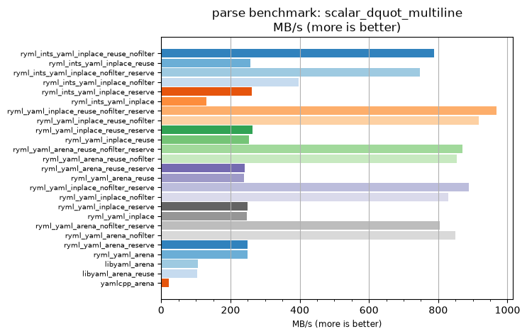
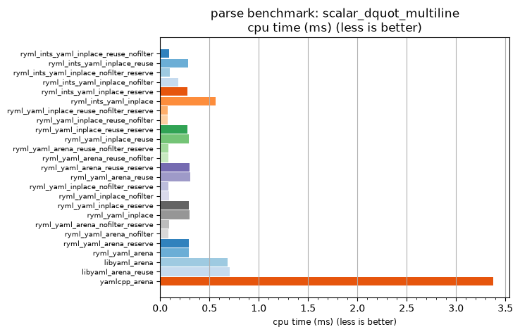

## parse benchmark: scalar_dquot_multiline

<p>Data type benchmark results:</p>
<ul>
   <li><pre><a href='#ryml-bm-parse-scalar_dquot_multiline-ryml_ints_yaml_inplace_reuse_nofilter'>ryml_ints_yaml_inplace_reuse_nofilter</a></pre></li> </ul>


<br/>
<br/>

---

<a id="ryml-bm-parse-scalar_dquot_multiline-ryml_ints_yaml_inplace_reuse_nofilter"/>

### parse benchmark: scalar_dquot_multiline

* Interactive html graphs
  * [MB/s](./ryml-bm-parse-scalar_dquot_multiline-mega_bytes_per_second.html)
  * [CPU time](./ryml-bm-parse-scalar_dquot_multiline-cpu_time_ms.html)

[](./ryml-bm-parse-scalar_dquot_multiline-mega_bytes_per_second.png)
[](./ryml-bm-parse-scalar_dquot_multiline-cpu_time_ms.png)

```
+---------------------------------------------------------------------------------------------------------------------+
|                                       parse benchmark: scalar_dquot_multiline                                       |
+------------------------------------------+---------+---------+----------+---------------+-------------+-------------+
| function                                 |    MB/s | MB/s(x) |  MB/s(%) | cpu time (ms) | cpu time(x) | cpu time(%) |
+------------------------------------------+---------+---------+----------+---------------+-------------+-------------+
| ryml_ints_yaml_inplace_reuse_nofilter    |  788.67 |  36.51x | 3550.99% |          0.09 |       0.03x |     -97.26% |
| ryml_ints_yaml_inplace_reuse             |  258.03 |  11.95x | 1094.51% |          0.28 |       0.08x |     -91.63% |
| ryml_ints_yaml_inplace_nofilter_reserve  |  746.42 |  34.55x | 3355.40% |          0.10 |       0.03x |     -97.11% |
| ryml_ints_yaml_inplace_nofilter          |  395.80 |  18.32x | 1732.24% |          0.18 |       0.05x |     -94.54% |
| ryml_ints_yaml_inplace_reserve           |  261.55 |  12.11x | 1110.77% |          0.28 |       0.08x |     -91.74% |
| ryml_ints_yaml_inplace                   |  129.59 |   6.00x |  499.90% |          0.56 |       0.17x |     -83.33% |
| ryml_yaml_inplace_reuse_nofilter_reserve |  967.63 |  44.79x | 4379.42% |          0.08 |       0.02x |     -97.77% |
| ryml_yaml_inplace_reuse_nofilter         |  916.70 |  42.44x | 4143.66% |          0.08 |       0.02x |     -97.64% |
| ryml_yaml_inplace_reuse_reserve          |  263.90 |  12.22x | 1121.66% |          0.28 |       0.08x |     -91.81% |
| ryml_yaml_inplace_reuse                  |  252.43 |  11.69x | 1068.54% |          0.29 |       0.09x |     -91.44% |
| ryml_yaml_arena_reuse_nofilter_reserve   |  870.83 |  40.31x | 3931.30% |          0.08 |       0.02x |     -97.52% |
| ryml_yaml_arena_reuse_nofilter           |  853.06 |  39.49x | 3849.03% |          0.09 |       0.03x |     -97.47% |
| ryml_yaml_arena_reuse_reserve            |  241.91 |  11.20x | 1019.86% |          0.30 |       0.09x |     -91.07% |
| ryml_yaml_arena_reuse                    |  239.14 |  11.07x | 1007.04% |          0.30 |       0.09x |     -90.97% |
| ryml_yaml_inplace_nofilter_reserve       |  889.36 |  41.17x | 4017.07% |          0.08 |       0.02x |     -97.57% |
| ryml_yaml_inplace_nofilter               |  829.36 |  38.39x | 3739.33% |          0.09 |       0.03x |     -97.40% |
| ryml_yaml_inplace_reserve                |  250.01 |  11.57x | 1057.36% |          0.29 |       0.09x |     -91.36% |
| ryml_yaml_inplace                        |  247.05 |  11.44x | 1043.68% |          0.30 |       0.09x |     -91.26% |
| ryml_yaml_arena_nofilter_reserve         |  803.84 |  37.21x | 3621.20% |          0.09 |       0.03x |     -97.31% |
| ryml_yaml_arena_nofilter                 |  849.63 |  39.33x | 3833.15% |          0.09 |       0.03x |     -97.46% |
| ryml_yaml_arena_reserve                  |  248.81 |  11.52x | 1051.80% |          0.29 |       0.09x |     -91.32% |
| ryml_yaml_arena                          |  250.01 |  11.57x | 1057.36% |          0.29 |       0.09x |     -91.36% |
| libyaml_arena                            |  106.63 |   4.94x |  393.63% |          0.68 |       0.20x |     -79.74% |
| libyaml_arena_reuse                      |  103.67 |   4.80x |  379.92% |          0.70 |       0.21x |     -79.16% |
| yamlcpp_arena                            |   21.60 |   1.00x |    0.00% |          3.37 |       1.00x |       0.00% |
+------------------------------------------+---------+---------+----------+---------------+-------------+-------------+
```

