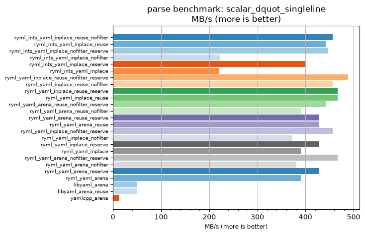
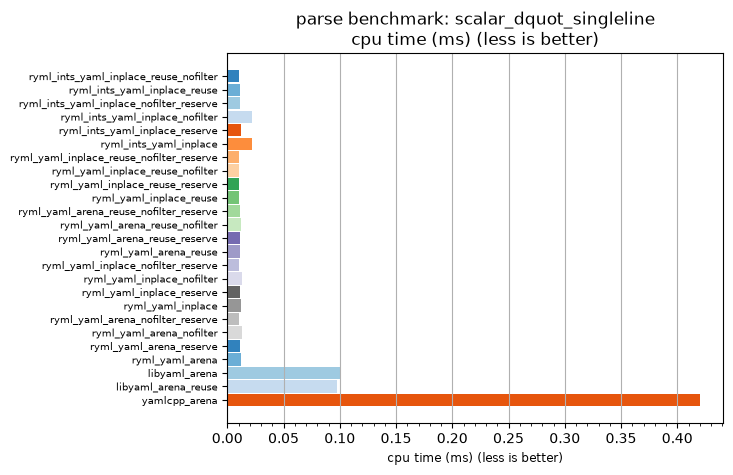

## parse benchmark: scalar_dquot_singleline

<p>Data type benchmark results:</p>
<ul>
   <li><pre><a href='#ryml-bm-parse-scalar_dquot_singleline-ryml_ints_yaml_inplace_reuse_nofilter'>ryml_ints_yaml_inplace_reuse_nofilter</a></pre></li> </ul>


<br/>
<br/>

---

<a id="ryml-bm-parse-scalar_dquot_singleline-ryml_ints_yaml_inplace_reuse_nofilter"/>

### parse benchmark: scalar_dquot_singleline

* Interactive html graphs
  * [MB/s](./ryml-bm-parse-scalar_dquot_singleline-mega_bytes_per_second.html)
  * [CPU time](./ryml-bm-parse-scalar_dquot_singleline-cpu_time_ms.html)

[](./ryml-bm-parse-scalar_dquot_singleline-mega_bytes_per_second.png)
[](./ryml-bm-parse-scalar_dquot_singleline-cpu_time_ms.png)

```
+---------------------------------------------------------------------------------------------------------------------+
|                                       parse benchmark: scalar_dquot_singleline                                      |
+------------------------------------------+---------+---------+----------+---------------+-------------+-------------+
| function                                 |    MB/s | MB/s(x) |  MB/s(%) | cpu time (ms) | cpu time(x) | cpu time(%) |
+------------------------------------------+---------+---------+----------+---------------+-------------+-------------+
| ryml_ints_yaml_inplace_reuse_nofilter    |  456.52 |  39.09x | 3809.09% |          0.01 |       0.03x |     -97.44% |
| ryml_ints_yaml_inplace_reuse             |  442.16 |  37.86x | 3686.18% |          0.01 |       0.03x |     -97.36% |
| ryml_ints_yaml_inplace_nofilter_reserve  |  446.37 |  38.22x | 3722.22% |          0.01 |       0.03x |     -97.38% |
| ryml_ints_yaml_inplace_nofilter          |  223.19 |  19.11x | 1811.11% |          0.02 |       0.05x |     -94.77% |
| ryml_ints_yaml_inplace_reserve           |  399.45 |  34.20x | 3320.45% |          0.01 |       0.03x |     -97.08% |
| ryml_ints_yaml_inplace                   |  221.08 |  18.93x | 1793.06% |          0.02 |       0.05x |     -94.72% |
| ryml_yaml_inplace_reuse_nofilter_reserve |  488.22 |  41.81x | 4080.56% |          0.01 |       0.02x |     -97.61% |
| ryml_yaml_inplace_reuse_nofilter         |  456.52 |  39.09x | 3809.09% |          0.01 |       0.03x |     -97.44% |
| ryml_yaml_inplace_reuse_reserve          |  467.13 |  40.00x | 3900.00% |          0.01 |       0.03x |     -97.50% |
| ryml_yaml_inplace_reuse                  |  467.13 |  40.00x | 3900.00% |          0.01 |       0.03x |     -97.50% |
| ryml_yaml_arena_reuse_nofilter_reserve   |  442.16 |  37.86x | 3686.18% |          0.01 |       0.03x |     -97.36% |
| ryml_yaml_arena_reuse_nofilter           |  390.58 |  33.44x | 3244.44% |          0.01 |       0.03x |     -97.01% |
| ryml_yaml_arena_reuse_reserve            |  428.68 |  36.71x | 3570.73% |          0.01 |       0.03x |     -97.28% |
| ryml_yaml_arena_reuse                    |  427.38 |  36.60x | 3559.57% |          0.01 |       0.03x |     -97.27% |
| ryml_yaml_inplace_nofilter_reserve       |  456.52 |  39.09x | 3809.09% |          0.01 |       0.03x |     -97.44% |
| ryml_yaml_inplace_nofilter               |  371.98 |  31.85x | 3085.20% |          0.01 |       0.03x |     -96.86% |
| ryml_yaml_inplace_reserve                |  428.68 |  36.71x | 3570.73% |          0.01 |       0.03x |     -97.28% |
| ryml_yaml_inplace                        |  390.58 |  33.44x | 3244.46% |          0.01 |       0.03x |     -97.01% |
| ryml_yaml_arena_nofilter_reserve         |  467.13 |  40.00x | 3900.00% |          0.01 |       0.03x |     -97.50% |
| ryml_yaml_arena_nofilter                 |  381.05 |  32.63x | 3162.89% |          0.01 |       0.03x |     -96.94% |
| ryml_yaml_arena_reserve                  |  427.38 |  36.60x | 3559.57% |          0.01 |       0.03x |     -97.27% |
| ryml_yaml_arena                          |  390.58 |  33.44x | 3244.44% |          0.01 |       0.03x |     -97.01% |
| libyaml_arena                            |   48.99 |   4.20x |  319.51% |          0.10 |       0.24x |     -76.16% |
| libyaml_arena_reuse                      |   50.22 |   4.30x |  330.00% |          0.10 |       0.23x |     -76.74% |
| yamlcpp_arena                            |   11.68 |   1.00x |    0.00% |          0.42 |       1.00x |       0.00% |
+------------------------------------------+---------+---------+----------+---------------+-------------+-------------+
```

