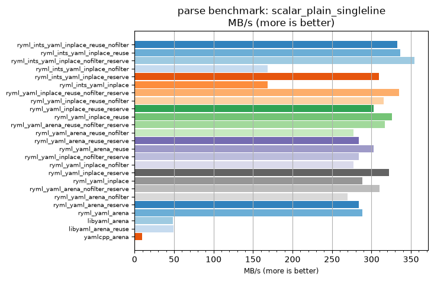
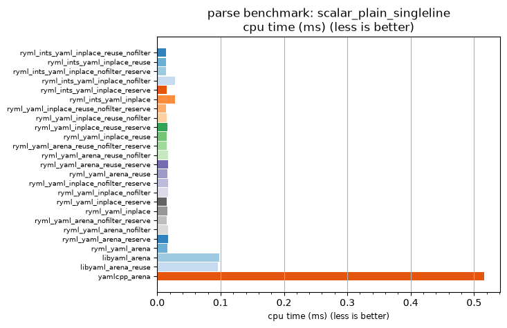

## parse benchmark: scalar_plain_singleline

<p>Data type benchmark results:</p>
<ul>
   <li><pre><a href='#ryml-bm-parse-scalar_plain_singleline-ryml_ints_yaml_inplace_reuse_nofilter'>ryml_ints_yaml_inplace_reuse_nofilter</a></pre></li> </ul>


<br/>
<br/>

---

<a id="ryml-bm-parse-scalar_plain_singleline-ryml_ints_yaml_inplace_reuse_nofilter"/>

### parse benchmark: scalar_plain_singleline

* Interactive html graphs
  * [MB/s](./ryml-bm-parse-scalar_plain_singleline-mega_bytes_per_second.html)
  * [CPU time](./ryml-bm-parse-scalar_plain_singleline-cpu_time_ms.html)

[](./ryml-bm-parse-scalar_plain_singleline-mega_bytes_per_second.png)
[](./ryml-bm-parse-scalar_plain_singleline-cpu_time_ms.png)

```
+---------------------------------------------------------------------------------------------------------------------+
|                                       parse benchmark: scalar_plain_singleline                                      |
+------------------------------------------+---------+---------+----------+---------------+-------------+-------------+
| function                                 |    MB/s | MB/s(x) |  MB/s(%) | cpu time (ms) | cpu time(x) | cpu time(%) |
+------------------------------------------+---------+---------+----------+---------------+-------------+-------------+
| ryml_ints_yaml_inplace_reuse_nofilter    |  332.60 |  36.06x | 3505.85% |          0.01 |       0.03x |     -97.23% |
| ryml_ints_yaml_inplace_reuse             |  336.70 |  36.50x | 3550.39% |          0.01 |       0.03x |     -97.26% |
| ryml_ints_yaml_inplace_nofilter_reserve  |  354.19 |  38.40x | 3739.97% |          0.01 |       0.03x |     -97.40% |
| ryml_ints_yaml_inplace_nofilter          |  168.35 |  18.25x | 1725.19% |          0.03 |       0.05x |     -94.52% |
| ryml_ints_yaml_inplace_reserve           |  309.22 |  33.52x | 3252.40% |          0.02 |       0.03x |     -97.02% |
| ryml_ints_yaml_inplace                   |  168.35 |  18.25x | 1725.19% |          0.03 |       0.05x |     -94.52% |
| ryml_yaml_inplace_reuse_nofilter_reserve |  335.04 |  36.32x | 3532.41% |          0.01 |       0.03x |     -97.25% |
| ryml_yaml_inplace_reuse_nofilter         |  315.66 |  34.22x | 3322.24% |          0.02 |       0.03x |     -97.08% |
| ryml_yaml_inplace_reuse_reserve          |  303.03 |  32.85x | 3185.35% |          0.02 |       0.03x |     -96.96% |
| ryml_yaml_inplace_reuse                  |  326.23 |  35.37x | 3436.82% |          0.01 |       0.03x |     -97.17% |
| ryml_yaml_arena_reuse_nofilter_reserve   |  317.13 |  34.38x | 3338.14% |          0.01 |       0.03x |     -97.09% |
| ryml_yaml_arena_reuse_nofilter           |  277.16 |  30.05x | 2904.85% |          0.02 |       0.03x |     -96.67% |
| ryml_yaml_arena_reuse_reserve            |  284.09 |  30.80x | 2980.00% |          0.02 |       0.03x |     -96.75% |
| ryml_yaml_arena_reuse                    |  303.03 |  32.85x | 3185.33% |          0.02 |       0.03x |     -96.96% |
| ryml_yaml_inplace_nofilter_reserve       |  284.09 |  30.80x | 2979.97% |          0.02 |       0.03x |     -96.75% |
| ryml_yaml_inplace_nofilter               |  277.16 |  30.05x | 2904.85% |          0.02 |       0.03x |     -96.67% |
| ryml_yaml_inplace_reserve                |  322.38 |  34.95x | 3395.05% |          0.01 |       0.03x |     -97.14% |
| ryml_yaml_inplace                        |  288.29 |  31.26x | 3025.56% |          0.02 |       0.03x |     -96.80% |
| ryml_yaml_arena_nofilter_reserve         |  309.92 |  33.60x | 3260.00% |          0.02 |       0.03x |     -97.02% |
| ryml_yaml_arena_nofilter                 |  269.49 |  29.22x | 2821.72% |          0.02 |       0.03x |     -96.58% |
| ryml_yaml_arena_reserve                  |  284.09 |  30.80x | 2980.00% |          0.02 |       0.03x |     -96.75% |
| ryml_yaml_arena                          |  288.29 |  31.26x | 3025.56% |          0.02 |       0.03x |     -96.80% |
| libyaml_arena                            |   48.70 |   5.28x |  428.00% |          0.10 |       0.19x |     -81.06% |
| libyaml_arena_reuse                      |   49.59 |   5.38x |  437.60% |          0.10 |       0.19x |     -81.40% |
| yamlcpp_arena                            |    9.22 |   1.00x |    0.00% |          0.52 |       1.00x |       0.00% |
+------------------------------------------+---------+---------+----------+---------------+-------------+-------------+
```

