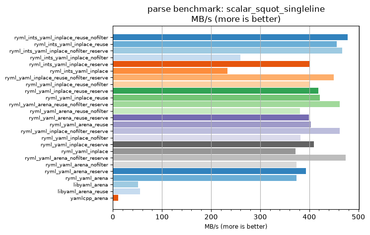
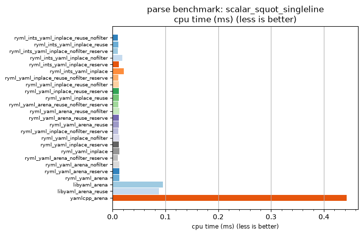

## parse benchmark: scalar_squot_singleline

<p>Data type benchmark results:</p>
<ul>
   <li><pre><a href='#ryml-bm-parse-scalar_squot_singleline-ryml_ints_yaml_inplace_reuse_nofilter'>ryml_ints_yaml_inplace_reuse_nofilter</a></pre></li> </ul>


<br/>
<br/>

---

<a id="ryml-bm-parse-scalar_squot_singleline-ryml_ints_yaml_inplace_reuse_nofilter"/>

### parse benchmark: scalar_squot_singleline

* Interactive html graphs
  * [MB/s](./ryml-bm-parse-scalar_squot_singleline-mega_bytes_per_second.html)
  * [CPU time](./ryml-bm-parse-scalar_squot_singleline-cpu_time_ms.html)

[](./ryml-bm-parse-scalar_squot_singleline-mega_bytes_per_second.png)
[](./ryml-bm-parse-scalar_squot_singleline-cpu_time_ms.png)

```
+---------------------------------------------------------------------------------------------------------------------+
|                                       parse benchmark: scalar_squot_singleline                                      |
+------------------------------------------+---------+---------+----------+---------------+-------------+-------------+
| function                                 |    MB/s | MB/s(x) |  MB/s(%) | cpu time (ms) | cpu time(x) | cpu time(%) |
+------------------------------------------+---------+---------+----------+---------------+-------------+-------------+
| ryml_ints_yaml_inplace_reuse_nofilter    |  477.87 |  43.17x | 4217.02% |          0.01 |       0.02x |     -97.68% |
| ryml_ints_yaml_inplace_reuse             |  456.15 |  41.21x | 4020.77% |          0.01 |       0.02x |     -97.57% |
| ryml_ints_yaml_inplace_nofilter_reserve  |  466.75 |  42.17x | 4116.61% |          0.01 |       0.02x |     -97.63% |
| ryml_ints_yaml_inplace_nofilter          |  260.17 |  23.50x | 2250.35% |          0.02 |       0.04x |     -95.75% |
| ryml_ints_yaml_inplace_reserve           |  400.27 |  36.16x | 3515.97% |          0.01 |       0.03x |     -97.23% |
| ryml_ints_yaml_inplace                   |  233.38 |  21.08x | 2008.30% |          0.02 |       0.05x |     -95.26% |
| ryml_yaml_inplace_reuse_nofilter_reserve |  450.30 |  40.68x | 3967.96% |          0.01 |       0.02x |     -97.54% |
| ryml_yaml_inplace_reuse_nofilter         |  401.41 |  36.26x | 3526.28% |          0.01 |       0.03x |     -97.24% |
| ryml_yaml_inplace_reuse_reserve          |  418.13 |  37.77x | 3677.38% |          0.01 |       0.03x |     -97.35% |
| ryml_yaml_inplace_reuse                  |  421.90 |  38.11x | 3711.42% |          0.01 |       0.03x |     -97.38% |
| ryml_yaml_arena_reuse_nofilter_reserve   |  462.15 |  41.75x | 4074.99% |          0.01 |       0.02x |     -97.60% |
| ryml_yaml_arena_reuse_nofilter           |  380.74 |  34.40x | 3339.58% |          0.01 |       0.03x |     -97.09% |
| ryml_yaml_arena_reuse_reserve            |  399.13 |  36.06x | 3505.68% |          0.01 |       0.03x |     -97.23% |
| ryml_yaml_arena_reuse                    |  403.72 |  36.47x | 3547.14% |          0.01 |       0.03x |     -97.26% |
| ryml_yaml_inplace_nofilter_reserve       |  462.15 |  41.75x | 4074.99% |          0.01 |       0.02x |     -97.60% |
| ryml_yaml_inplace_nofilter               |  381.77 |  34.49x | 3348.91% |          0.01 |       0.03x |     -97.10% |
| ryml_yaml_inplace_reserve                |  409.60 |  37.00x | 3600.29% |          0.01 |       0.03x |     -97.30% |
| ryml_yaml_inplace                        |  371.68 |  33.58x | 3257.68% |          0.01 |       0.03x |     -97.02% |
| ryml_yaml_arena_nofilter_reserve         |  474.64 |  42.88x | 4187.83% |          0.01 |       0.02x |     -97.67% |
| ryml_yaml_arena_nofilter                 |  373.65 |  33.76x | 3275.53% |          0.01 |       0.03x |     -97.04% |
| ryml_yaml_arena_reserve                  |  393.54 |  35.55x | 3455.18% |          0.01 |       0.03x |     -97.19% |
| ryml_yaml_arena                          |  373.65 |  33.76x | 3275.53% |          0.01 |       0.03x |     -97.04% |
| libyaml_arena                            |   51.46 |   4.65x |  364.91% |          0.10 |       0.22x |     -78.49% |
| libyaml_arena_reuse                      |   55.75 |   5.04x |  403.67% |          0.09 |       0.20x |     -80.15% |
| yamlcpp_arena                            |   11.07 |   1.00x |    0.00% |          0.44 |       1.00x |       0.00% |
+------------------------------------------+---------+---------+----------+---------------+-------------+-------------+
```

