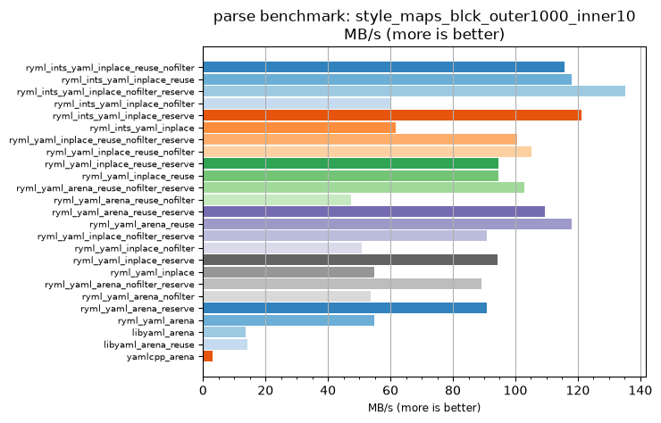
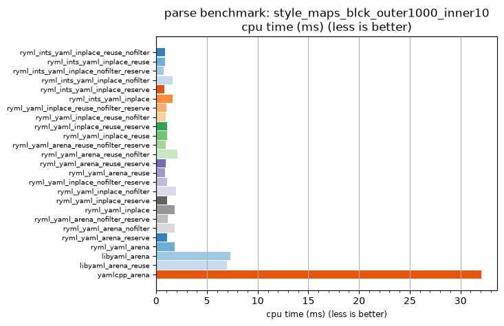

## parse benchmark: style_maps_blck_outer1000_inner10

<p>Data type benchmark results:</p>
<ul>
   <li><pre><a href='#ryml-bm-parse-style_maps_blck_outer1000_inner10-ryml_ints_yaml_inplace_reuse_nofilter'>ryml_ints_yaml_inplace_reuse_nofilter</a></pre></li> </ul>


<br/>
<br/>

---

<a id="ryml-bm-parse-style_maps_blck_outer1000_inner10-ryml_ints_yaml_inplace_reuse_nofilter"/>

### parse benchmark: style_maps_blck_outer1000_inner10

* Interactive html graphs
  * [MB/s](./ryml-bm-parse-style_maps_blck_outer1000_inner10-mega_bytes_per_second.html)
  * [CPU time](./ryml-bm-parse-style_maps_blck_outer1000_inner10-cpu_time_ms.html)

[](./ryml-bm-parse-style_maps_blck_outer1000_inner10-mega_bytes_per_second.png)
[](./ryml-bm-parse-style_maps_blck_outer1000_inner10-cpu_time_ms.png)

```
+---------------------------------------------------------------------------------------------------------------------+
|                                  parse benchmark: style_maps_blck_outer1000_inner10                                 |
+------------------------------------------+---------+---------+----------+---------------+-------------+-------------+
| function                                 |    MB/s | MB/s(x) |  MB/s(%) | cpu time (ms) | cpu time(x) | cpu time(%) |
+------------------------------------------+---------+---------+----------+---------------+-------------+-------------+
| ryml_ints_yaml_inplace_reuse_nofilter    |  115.74 |  37.49x | 3648.57% |          0.85 |       0.03x |     -97.33% |
| ryml_ints_yaml_inplace_reuse             |  118.15 |  38.27x | 3726.67% |          0.84 |       0.03x |     -97.39% |
| ryml_ints_yaml_inplace_nofilter_reserve  |  135.09 |  43.75x | 4275.29% |          0.73 |       0.02x |     -97.71% |
| ryml_ints_yaml_inplace_nofilter          |   60.33 |  19.54x | 1854.04% |          1.64 |       0.05x |     -94.88% |
| ryml_ints_yaml_inplace_reserve           |  121.24 |  39.27x | 3826.54% |          0.82 |       0.03x |     -97.45% |
| ryml_ints_yaml_inplace                   |   61.81 |  20.02x | 1901.76% |          1.60 |       0.05x |     -95.00% |
| ryml_yaml_inplace_reuse_nofilter_reserve |  100.60 |  32.58x | 3158.19% |          0.98 |       0.03x |     -96.93% |
| ryml_yaml_inplace_reuse_nofilter         |  105.07 |  34.03x | 3303.00% |          0.94 |       0.03x |     -97.06% |
| ryml_yaml_inplace_reuse_reserve          |   94.57 |  30.63x | 2962.70% |          1.05 |       0.03x |     -96.73% |
| ryml_yaml_inplace_reuse                  |   94.52 |  30.61x | 2961.33% |          1.05 |       0.03x |     -96.73% |
| ryml_yaml_arena_reuse_nofilter_reserve   |  102.79 |  33.29x | 3229.02% |          0.96 |       0.03x |     -97.00% |
| ryml_yaml_arena_reuse_nofilter           |   47.47 |  15.38x | 1437.50% |          2.08 |       0.07x |     -93.50% |
| ryml_yaml_arena_reuse_reserve            |  109.49 |  35.46x | 3445.95% |          0.90 |       0.03x |     -97.18% |
| ryml_yaml_arena_reuse                    |  118.15 |  38.27x | 3726.67% |          0.84 |       0.03x |     -97.39% |
| ryml_yaml_inplace_nofilter_reserve       |   90.93 |  29.45x | 2844.90% |          1.09 |       0.03x |     -96.60% |
| ryml_yaml_inplace_nofilter               |   50.78 |  16.45x | 1544.77% |          1.95 |       0.06x |     -93.92% |
| ryml_yaml_inplace_reserve                |   94.21 |  30.51x | 2951.16% |          1.05 |       0.03x |     -96.72% |
| ryml_yaml_inplace                        |   54.81 |  17.75x | 1675.21% |          1.80 |       0.06x |     -94.37% |
| ryml_yaml_arena_nofilter_reserve         |   89.21 |  28.89x | 2789.34% |          1.11 |       0.03x |     -96.54% |
| ryml_yaml_arena_nofilter                 |   53.66 |  17.38x | 1637.84% |          1.84 |       0.06x |     -94.25% |
| ryml_yaml_arena_reserve                  |   90.93 |  29.45x | 2844.90% |          1.09 |       0.03x |     -96.60% |
| ryml_yaml_arena                          |   54.91 |  17.78x | 1678.26% |          1.80 |       0.06x |     -94.38% |
| libyaml_arena                            |   13.56 |   4.39x |  339.29% |          7.29 |       0.23x |     -77.24% |
| libyaml_arena_reuse                      |   14.18 |   4.59x |  359.20% |          6.98 |       0.22x |     -78.22% |
| yamlcpp_arena                            |    3.09 |   1.00x |    0.00% |         32.03 |       1.00x |       0.00% |
+------------------------------------------+---------+---------+----------+---------------+-------------+-------------+
```

