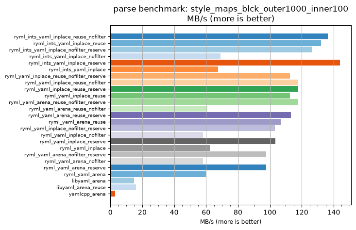
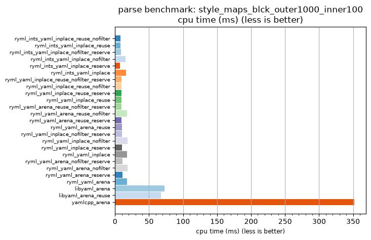

## parse benchmark: style_maps_blck_outer1000_inner100

<p>Data type benchmark results:</p>
<ul>
   <li><pre><a href='#ryml-bm-parse-style_maps_blck_outer1000_inner100-ryml_ints_yaml_inplace_reuse_nofilter'>ryml_ints_yaml_inplace_reuse_nofilter</a></pre></li> </ul>


<br/>
<br/>

---

<a id="ryml-bm-parse-style_maps_blck_outer1000_inner100-ryml_ints_yaml_inplace_reuse_nofilter"/>

### parse benchmark: style_maps_blck_outer1000_inner100

* Interactive html graphs
  * [MB/s](./ryml-bm-parse-style_maps_blck_outer1000_inner100-mega_bytes_per_second.html)
  * [CPU time](./ryml-bm-parse-style_maps_blck_outer1000_inner100-cpu_time_ms.html)

[](./ryml-bm-parse-style_maps_blck_outer1000_inner100-mega_bytes_per_second.png)
[](./ryml-bm-parse-style_maps_blck_outer1000_inner100-cpu_time_ms.png)

```
+---------------------------------------------------------------------------------------------------------------------+
|                                 parse benchmark: style_maps_blck_outer1000_inner100                                 |
+------------------------------------------+---------+---------+----------+---------------+-------------+-------------+
| function                                 |    MB/s | MB/s(x) |  MB/s(%) | cpu time (ms) | cpu time(x) | cpu time(%) |
+------------------------------------------+---------+---------+----------+---------------+-------------+-------------+
| ryml_ints_yaml_inplace_reuse_nofilter    |  136.29 |  44.41x | 4340.79% |          7.92 |       0.02x |     -97.75% |
| ryml_ints_yaml_inplace_reuse             |  132.24 |  43.09x | 4208.51% |          8.16 |       0.02x |     -97.68% |
| ryml_ints_yaml_inplace_nofilter_reserve  |  126.32 |  41.16x | 4015.85% |          8.54 |       0.02x |     -97.57% |
| ryml_ints_yaml_inplace_nofilter          |   69.06 |  22.50x | 2150.00% |         15.62 |       0.04x |     -95.56% |
| ryml_ints_yaml_inplace_reserve           |  143.87 |  46.88x | 4587.50% |          7.50 |       0.02x |     -97.87% |
| ryml_ints_yaml_inplace                   |   67.55 |  22.01x | 2101.09% |         15.97 |       0.05x |     -95.46% |
| ryml_yaml_inplace_reuse_nofilter_reserve |  112.59 |  36.68x | 3568.48% |          9.58 |       0.03x |     -97.27% |
| ryml_yaml_inplace_reuse_nofilter         |  117.71 |  38.35x | 3735.23% |          9.17 |       0.03x |     -97.39% |
| ryml_yaml_inplace_reuse_reserve          |  117.71 |  38.35x | 3735.23% |          9.17 |       0.03x |     -97.39% |
| ryml_yaml_inplace_reuse                  |  112.59 |  36.68x | 3568.48% |          9.58 |       0.03x |     -97.27% |
| ryml_yaml_arena_reuse_nofilter_reserve   |  117.71 |  38.35x | 3735.23% |          9.17 |       0.03x |     -97.39% |
| ryml_yaml_arena_reuse_nofilter           |   60.84 |  19.82x | 1882.14% |         17.74 |       0.05x |     -94.95% |
| ryml_yaml_arena_reuse_reserve            |  113.32 |  36.92x | 3592.31% |          9.52 |       0.03x |     -97.29% |
| ryml_yaml_arena_reuse                    |  107.16 |  34.91x | 3391.38% |         10.07 |       0.03x |     -97.14% |
| ryml_yaml_inplace_nofilter_reserve       |  103.07 |  33.58x | 3258.21% |         10.47 |       0.03x |     -97.02% |
| ryml_yaml_inplace_nofilter               |   58.07 |  18.92x | 1792.05% |         18.58 |       0.05x |     -94.71% |
| ryml_yaml_inplace_reserve                |  103.58 |  33.75x | 3275.00% |         10.42 |       0.03x |     -97.04% |
| ryml_yaml_inplace                        |   62.32 |  20.30x | 1930.49% |         17.31 |       0.05x |     -95.08% |
| ryml_yaml_arena_nofilter_reserve         |   97.72 |  31.84x | 3083.96% |         11.04 |       0.03x |     -96.86% |
| ryml_yaml_arena_nofilter                 |   58.07 |  18.92x | 1792.05% |         18.58 |       0.05x |     -94.71% |
| ryml_yaml_arena_reserve                  |   97.58 |  31.79x | 3079.35% |         11.06 |       0.03x |     -96.85% |
| ryml_yaml_arena                          |   60.24 |  19.63x | 1862.77% |         17.91 |       0.05x |     -94.91% |
| libyaml_arena                            |   14.80 |   4.82x |  382.14% |         72.92 |       0.21x |     -79.26% |
| libyaml_arena_reuse                      |   15.94 |   5.19x |  419.23% |         67.71 |       0.19x |     -80.74% |
| yamlcpp_arena                            |    3.07 |   1.00x |    0.00% |        351.56 |       1.00x |       0.00% |
+------------------------------------------+---------+---------+----------+---------------+-------------+-------------+
```

