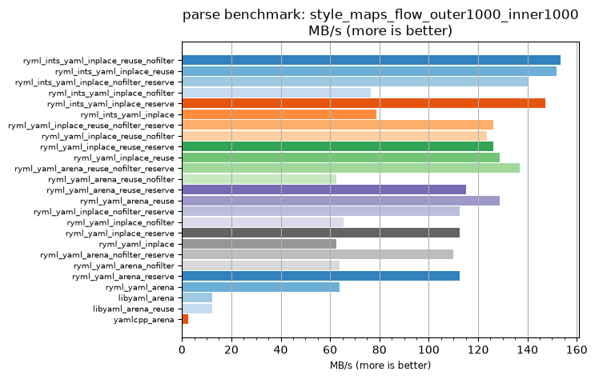
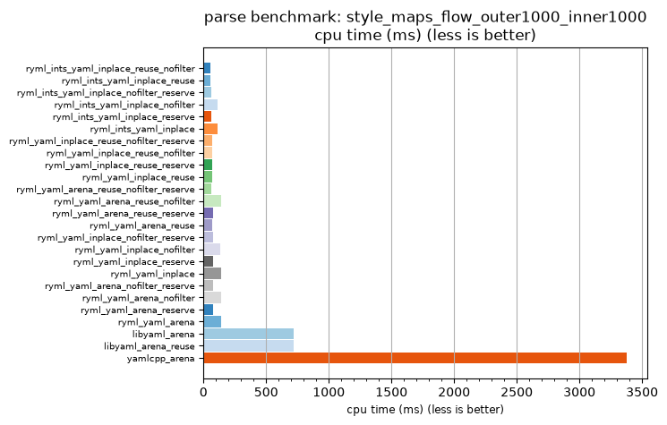

## parse benchmark: style_maps_flow_outer1000_inner1000

<p>Data type benchmark results:</p>
<ul>
   <li><pre><a href='#ryml-bm-parse-style_maps_flow_outer1000_inner1000-ryml_ints_yaml_inplace_reuse_nofilter'>ryml_ints_yaml_inplace_reuse_nofilter</a></pre></li> </ul>


<br/>
<br/>

---

<a id="ryml-bm-parse-style_maps_flow_outer1000_inner1000-ryml_ints_yaml_inplace_reuse_nofilter"/>

### parse benchmark: style_maps_flow_outer1000_inner1000

* Interactive html graphs
  * [MB/s](./ryml-bm-parse-style_maps_flow_outer1000_inner1000-mega_bytes_per_second.html)
  * [CPU time](./ryml-bm-parse-style_maps_flow_outer1000_inner1000-cpu_time_ms.html)

[](./ryml-bm-parse-style_maps_flow_outer1000_inner1000-mega_bytes_per_second.png)
[](./ryml-bm-parse-style_maps_flow_outer1000_inner1000-cpu_time_ms.png)

```
+---------------------------------------------------------------------------------------------------------------------+
|                                 parse benchmark: style_maps_flow_outer1000_inner1000                                |
+------------------------------------------+---------+---------+----------+---------------+-------------+-------------+
| function                                 |    MB/s | MB/s(x) |  MB/s(%) | cpu time (ms) | cpu time(x) | cpu time(%) |
+------------------------------------------+---------+---------+----------+---------------+-------------+-------------+
| ryml_ints_yaml_inplace_reuse_nofilter    |  153.34 |  58.91x | 5790.91% |         57.29 |       0.02x |     -98.30% |
| ryml_ints_yaml_inplace_reuse             |  151.96 |  58.38x | 5737.84% |         57.81 |       0.02x |     -98.29% |
| ryml_ints_yaml_inplace_nofilter_reserve  |  140.56 |  54.00x | 5300.00% |         62.50 |       0.02x |     -98.15% |
| ryml_ints_yaml_inplace_nofilter          |   76.67 |  29.45x | 2845.45% |        114.58 |       0.03x |     -96.60% |
| ryml_ints_yaml_inplace_reserve           |  147.25 |  56.57x | 5557.14% |         59.66 |       0.02x |     -98.23% |
| ryml_ints_yaml_inplace                   |   78.71 |  30.24x | 2924.00% |        111.61 |       0.03x |     -96.69% |
| ryml_yaml_inplace_reuse_nofilter_reserve |  126.22 |  48.49x | 4748.98% |         69.60 |       0.02x |     -97.94% |
| ryml_yaml_inplace_reuse_nofilter         |  123.69 |  47.52x | 4652.00% |         71.02 |       0.02x |     -97.90% |
| ryml_yaml_inplace_reuse_reserve          |  126.22 |  48.49x | 4748.98% |         69.60 |       0.02x |     -97.94% |
| ryml_yaml_inplace_reuse                  |  128.85 |  49.50x | 4850.00% |         68.18 |       0.02x |     -97.98% |
| ryml_yaml_arena_reuse_nofilter_reserve   |  136.76 |  52.54x | 5154.05% |         64.24 |       0.02x |     -98.10% |
| ryml_yaml_arena_reuse_nofilter           |   62.47 |  24.00x | 2300.00% |        140.62 |       0.04x |     -95.83% |
| ryml_yaml_arena_reuse_reserve            |  115.00 |  44.18x | 4318.18% |         76.39 |       0.02x |     -97.74% |
| ryml_yaml_arena_reuse                    |  128.85 |  49.50x | 4850.00% |         68.18 |       0.02x |     -97.98% |
| ryml_yaml_inplace_nofilter_reserve       |  112.45 |  43.20x | 4220.00% |         78.12 |       0.02x |     -97.69% |
| ryml_yaml_inplace_nofilter               |   65.38 |  25.12x | 2411.63% |        134.38 |       0.04x |     -96.02% |
| ryml_yaml_inplace_reserve                |  112.45 |  43.20x | 4220.00% |         78.12 |       0.02x |     -97.69% |
| ryml_yaml_inplace                        |   62.47 |  24.00x | 2300.00% |        140.62 |       0.04x |     -95.83% |
| ryml_yaml_arena_nofilter_reserve         |  110.00 |  42.26x | 4126.09% |         79.86 |       0.02x |     -97.63% |
| ryml_yaml_arena_nofilter                 |   63.89 |  24.55x | 2354.55% |        137.50 |       0.04x |     -95.93% |
| ryml_yaml_arena_reserve                  |  112.45 |  43.20x | 4220.00% |         78.12 |       0.02x |     -97.69% |
| ryml_yaml_arena                          |   63.89 |  24.55x | 2354.55% |        137.50 |       0.04x |     -95.93% |
| libyaml_arena                            |   12.22 |   4.70x |  369.57% |        718.75 |       0.21x |     -78.70% |
| libyaml_arena_reuse                      |   12.22 |   4.70x |  369.57% |        718.75 |       0.21x |     -78.70% |
| yamlcpp_arena                            |    2.60 |   1.00x |    0.00% |       3375.00 |       1.00x |       0.00% |
+------------------------------------------+---------+---------+----------+---------------+-------------+-------------+
```

