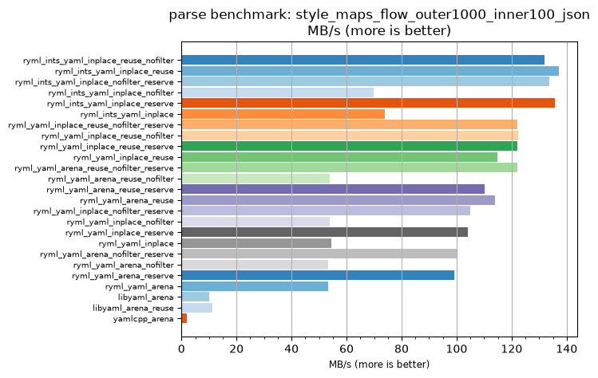
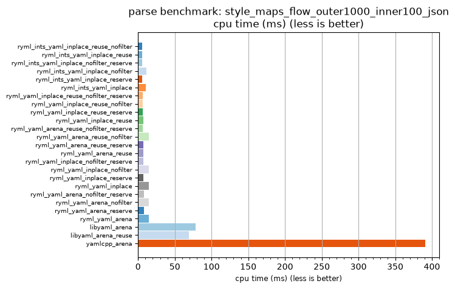

## parse benchmark: style_maps_flow_outer1000_inner100_json

<p>Data type benchmark results:</p>
<ul>
   <li><pre><a href='#ryml-bm-parse-style_maps_flow_outer1000_inner100_json-ryml_ints_yaml_inplace_reuse_nofilter'>ryml_ints_yaml_inplace_reuse_nofilter</a></pre></li> </ul>


<br/>
<br/>

---

<a id="ryml-bm-parse-style_maps_flow_outer1000_inner100_json-ryml_ints_yaml_inplace_reuse_nofilter"/>

### parse benchmark: style_maps_flow_outer1000_inner100_json

* Interactive html graphs
  * [MB/s](./ryml-bm-parse-style_maps_flow_outer1000_inner100_json-mega_bytes_per_second.html)
  * [CPU time](./ryml-bm-parse-style_maps_flow_outer1000_inner100_json-cpu_time_ms.html)

[](./ryml-bm-parse-style_maps_flow_outer1000_inner100_json-mega_bytes_per_second.png)
[](./ryml-bm-parse-style_maps_flow_outer1000_inner100_json-cpu_time_ms.png)

```
+---------------------------------------------------------------------------------------------------------------------+
|                               parse benchmark: style_maps_flow_outer1000_inner100_json                              |
+------------------------------------------+---------+---------+----------+---------------+-------------+-------------+
| function                                 |    MB/s | MB/s(x) |  MB/s(%) | cpu time (ms) | cpu time(x) | cpu time(%) |
+------------------------------------------+---------+---------+----------+---------------+-------------+-------------+
| ryml_ints_yaml_inplace_reuse_nofilter    |  132.04 |  65.79x | 6478.95% |          5.94 |       0.02x |     -98.48% |
| ryml_ints_yaml_inplace_reuse             |  137.07 |  68.29x | 6729.27% |          5.72 |       0.01x |     -98.54% |
| ryml_ints_yaml_inplace_nofilter_reserve  |  133.80 |  66.67x | 6566.67% |          5.86 |       0.01x |     -98.50% |
| ryml_ints_yaml_inplace_nofilter          |   69.81 |  34.78x | 3378.26% |         11.23 |       0.03x |     -97.12% |
| ryml_ints_yaml_inplace_reserve           |  135.61 |  67.57x | 6656.76% |          5.78 |       0.01x |     -98.52% |
| ryml_ints_yaml_inplace                   |   73.79 |  36.76x | 3576.47% |         10.62 |       0.03x |     -97.28% |
| ryml_yaml_inplace_reuse_nofilter_reserve |  122.05 |  60.81x | 5981.08% |          6.42 |       0.02x |     -98.36% |
| ryml_yaml_inplace_reuse_nofilter         |  122.38 |  60.98x | 5997.56% |          6.41 |       0.02x |     -98.36% |
| ryml_yaml_inplace_reuse_reserve          |  122.05 |  60.81x | 5981.08% |          6.42 |       0.02x |     -98.36% |
| ryml_yaml_inplace_reuse                  |  114.69 |  57.14x | 5614.29% |          6.84 |       0.02x |     -98.25% |
| ryml_yaml_arena_reuse_nofilter_reserve   |  122.05 |  60.81x | 5981.08% |          6.42 |       0.02x |     -98.36% |
| ryml_yaml_arena_reuse_nofilter           |   53.76 |  26.79x | 2578.57% |         14.58 |       0.04x |     -96.27% |
| ryml_yaml_arena_reuse_reserve            |  110.19 |  54.90x | 5390.20% |          7.11 |       0.02x |     -98.18% |
| ryml_yaml_arena_reuse                    |  114.04 |  56.82x | 5581.82% |          6.88 |       0.02x |     -98.24% |
| ryml_yaml_inplace_nofilter_reserve       |  105.02 |  52.33x | 5132.56% |          7.47 |       0.02x |     -98.09% |
| ryml_yaml_inplace_nofilter               |   53.76 |  26.79x | 2578.57% |         14.58 |       0.04x |     -96.27% |
| ryml_yaml_inplace_reserve                |  104.07 |  51.85x | 5085.19% |          7.53 |       0.02x |     -98.07% |
| ryml_yaml_inplace                        |   54.54 |  27.17x | 2617.39% |         14.38 |       0.04x |     -96.32% |
| ryml_yaml_arena_nofilter_reserve         |  100.35 |  50.00x | 4900.00% |          7.81 |       0.02x |     -98.00% |
| ryml_yaml_arena_nofilter                 |   53.38 |  26.60x | 2559.57% |         14.69 |       0.04x |     -96.24% |
| ryml_yaml_arena_reserve                  |   99.03 |  49.34x | 4834.21% |          7.92 |       0.02x |     -97.97% |
| ryml_yaml_arena                          |   53.38 |  26.60x | 2559.57% |         14.69 |       0.04x |     -96.24% |
| libyaml_arena                            |   10.04 |   5.00x |  400.00% |         78.12 |       0.20x |     -80.00% |
| libyaml_arena_reuse                      |   11.29 |   5.62x |  462.50% |         69.44 |       0.18x |     -82.22% |
| yamlcpp_arena                            |    2.01 |   1.00x |    0.00% |        390.62 |       1.00x |       0.00% |
+------------------------------------------+---------+---------+----------+---------------+-------------+-------------+
```

