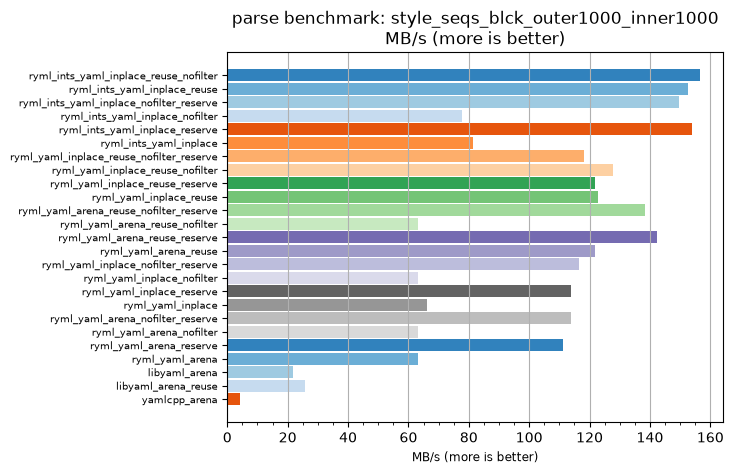
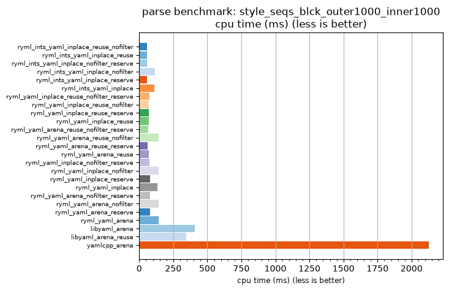

## parse benchmark: style_seqs_blck_outer1000_inner1000

<p>Data type benchmark results:</p>
<ul>
   <li><pre><a href='#ryml-bm-parse-style_seqs_blck_outer1000_inner1000-ryml_ints_yaml_inplace_reuse_nofilter'>ryml_ints_yaml_inplace_reuse_nofilter</a></pre></li> </ul>


<br/>
<br/>

---

<a id="ryml-bm-parse-style_seqs_blck_outer1000_inner1000-ryml_ints_yaml_inplace_reuse_nofilter"/>

### parse benchmark: style_seqs_blck_outer1000_inner1000

* Interactive html graphs
  * [MB/s](./ryml-bm-parse-style_seqs_blck_outer1000_inner1000-mega_bytes_per_second.html)
  * [CPU time](./ryml-bm-parse-style_seqs_blck_outer1000_inner1000-cpu_time_ms.html)

[](./ryml-bm-parse-style_seqs_blck_outer1000_inner1000-mega_bytes_per_second.png)
[](./ryml-bm-parse-style_seqs_blck_outer1000_inner1000-cpu_time_ms.png)

```
+---------------------------------------------------------------------------------------------------------------------+
|                                 parse benchmark: style_seqs_blck_outer1000_inner1000                                |
+------------------------------------------+---------+---------+----------+---------------+-------------+-------------+
| function                                 |    MB/s | MB/s(x) |  MB/s(%) | cpu time (ms) | cpu time(x) | cpu time(%) |
+------------------------------------------+---------+---------+----------+---------------+-------------+-------------+
| ryml_ints_yaml_inplace_reuse_nofilter    |  156.46 |  37.40x | 3640.00% |         56.82 |       0.03x |     -97.33% |
| ryml_ints_yaml_inplace_reuse             |  152.65 |  36.49x | 3548.78% |         58.24 |       0.03x |     -97.26% |
| ryml_ints_yaml_inplace_nofilter_reserve  |  149.73 |  35.79x | 3478.95% |         59.38 |       0.03x |     -97.21% |
| ryml_ints_yaml_inplace_nofilter          |   77.59 |  18.55x | 1754.55% |        114.58 |       0.05x |     -94.61% |
| ryml_ints_yaml_inplace_reserve           |  153.77 |  36.76x | 3575.68% |         57.81 |       0.03x |     -97.28% |
| ryml_ints_yaml_inplace                   |   81.28 |  19.43x | 1842.86% |        109.38 |       0.05x |     -94.85% |
| ryml_yaml_inplace_reuse_nofilter_reserve |  118.09 |  28.23x | 2722.64% |         75.28 |       0.04x |     -96.46% |
| ryml_yaml_inplace_reuse_nofilter         |  127.73 |  30.53x | 2953.06% |         69.60 |       0.03x |     -96.72% |
| ryml_yaml_inplace_reuse_reserve          |  121.92 |  29.14x | 2814.29% |         72.92 |       0.03x |     -96.57% |
| ryml_yaml_inplace_reuse                  |  122.72 |  29.33x | 2833.33% |         72.44 |       0.03x |     -96.59% |
| ryml_yaml_arena_reuse_nofilter_reserve   |  138.40 |  33.08x | 3208.11% |         64.24 |       0.03x |     -96.98% |
| ryml_yaml_arena_reuse_nofilter           |   63.22 |  15.11x | 1411.11% |        140.62 |       0.07x |     -93.38% |
| ryml_yaml_arena_reuse_reserve            |  142.24 |  34.00x | 3300.00% |         62.50 |       0.03x |     -97.06% |
| ryml_yaml_arena_reuse                    |  121.92 |  29.14x | 2814.29% |         72.92 |       0.03x |     -96.57% |
| ryml_yaml_inplace_nofilter_reserve       |  116.38 |  27.82x | 2681.82% |         76.39 |       0.04x |     -96.41% |
| ryml_yaml_inplace_nofilter               |   63.22 |  15.11x | 1411.11% |        140.62 |       0.07x |     -93.38% |
| ryml_yaml_inplace_reserve                |  113.79 |  27.20x | 2620.00% |         78.12 |       0.04x |     -96.32% |
| ryml_yaml_inplace                        |   66.16 |  15.81x | 1481.40% |        134.38 |       0.06x |     -93.68% |
| ryml_yaml_arena_nofilter_reserve         |  113.79 |  27.20x | 2620.00% |         78.12 |       0.04x |     -96.32% |
| ryml_yaml_arena_nofilter                 |   63.22 |  15.11x | 1411.11% |        140.62 |       0.07x |     -93.38% |
| ryml_yaml_arena_reserve                  |  111.32 |  26.61x | 2560.87% |         79.86 |       0.04x |     -96.24% |
| ryml_yaml_arena                          |   63.22 |  15.11x | 1411.11% |        140.62 |       0.07x |     -93.38% |
| libyaml_arena                            |   21.88 |   5.23x |  423.08% |        406.25 |       0.19x |     -80.88% |
| libyaml_arena_reuse                      |   25.86 |   6.18x |  518.18% |        343.75 |       0.16x |     -83.82% |
| yamlcpp_arena                            |    4.18 |   1.00x |    0.00% |       2125.00 |       1.00x |       0.00% |
+------------------------------------------+---------+---------+----------+---------------+-------------+-------------+
```

