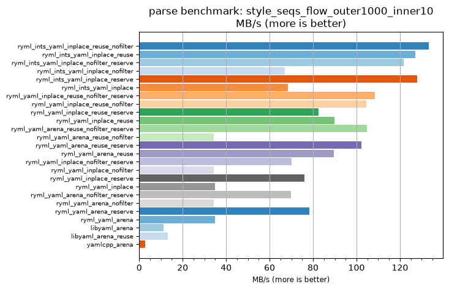
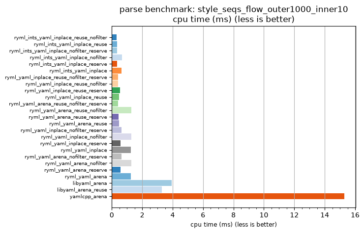

## parse benchmark: style_seqs_flow_outer1000_inner10

<p>Data type benchmark results:</p>
<ul>
   <li><pre><a href='#ryml-bm-parse-style_seqs_flow_outer1000_inner10-ryml_ints_yaml_inplace_reuse_nofilter'>ryml_ints_yaml_inplace_reuse_nofilter</a></pre></li> </ul>


<br/>
<br/>

---

<a id="ryml-bm-parse-style_seqs_flow_outer1000_inner10-ryml_ints_yaml_inplace_reuse_nofilter"/>

### parse benchmark: style_seqs_flow_outer1000_inner10

* Interactive html graphs
  * [MB/s](./ryml-bm-parse-style_seqs_flow_outer1000_inner10-mega_bytes_per_second.html)
  * [CPU time](./ryml-bm-parse-style_seqs_flow_outer1000_inner10-cpu_time_ms.html)

[](./ryml-bm-parse-style_seqs_flow_outer1000_inner10-mega_bytes_per_second.png)
[](./ryml-bm-parse-style_seqs_flow_outer1000_inner10-cpu_time_ms.png)

```
+---------------------------------------------------------------------------------------------------------------------+
|                                  parse benchmark: style_seqs_flow_outer1000_inner10                                 |
+------------------------------------------+---------+---------+----------+---------------+-------------+-------------+
| function                                 |    MB/s | MB/s(x) |  MB/s(%) | cpu time (ms) | cpu time(x) | cpu time(%) |
+------------------------------------------+---------+---------+----------+---------------+-------------+-------------+
| ryml_ints_yaml_inplace_reuse_nofilter    |  133.18 |  46.35x | 4534.67% |          0.33 |       0.02x |     -97.84% |
| ryml_ints_yaml_inplace_reuse             |  127.12 |  44.24x | 4323.90% |          0.35 |       0.02x |     -97.74% |
| ryml_ints_yaml_inplace_nofilter_reserve  |  121.63 |  42.33x | 4132.69% |          0.36 |       0.02x |     -97.64% |
| ryml_ints_yaml_inplace_nofilter          |   66.95 |  23.30x | 2230.02% |          0.66 |       0.04x |     -95.71% |
| ryml_ints_yaml_inplace_reserve           |  127.94 |  44.52x | 4352.47% |          0.34 |       0.02x |     -97.75% |
| ryml_ints_yaml_inplace                   |   68.41 |  23.81x | 2280.68% |          0.64 |       0.04x |     -95.80% |
| ryml_yaml_inplace_reuse_nofilter_reserve |  108.52 |  37.77x | 3676.67% |          0.40 |       0.03x |     -97.35% |
| ryml_yaml_inplace_reuse_nofilter         |  104.55 |  36.38x | 3538.24% |          0.42 |       0.03x |     -97.25% |
| ryml_yaml_inplace_reuse_reserve          |   82.64 |  28.76x | 2775.82% |          0.53 |       0.03x |     -96.52% |
| ryml_yaml_inplace_reuse                  |   89.91 |  31.29x | 3028.89% |          0.49 |       0.03x |     -96.80% |
| ryml_yaml_arena_reuse_nofilter_reserve   |  104.91 |  36.51x | 3551.02% |          0.42 |       0.03x |     -97.26% |
| ryml_yaml_arena_reuse_nofilter           |   34.20 |  11.90x | 1090.34% |          1.28 |       0.08x |     -91.60% |
| ryml_yaml_arena_reuse_reserve            |  102.17 |  35.56x | 3455.56% |          0.43 |       0.03x |     -97.19% |
| ryml_yaml_arena_reuse                    |   89.64 |  31.19x | 3019.49% |          0.49 |       0.03x |     -96.79% |
| ryml_yaml_inplace_nofilter_reserve       |   70.24 |  24.44x | 2344.44% |          0.62 |       0.04x |     -95.91% |
| ryml_yaml_inplace_nofilter               |   34.20 |  11.90x | 1090.34% |          1.28 |       0.08x |     -91.60% |
| ryml_yaml_inplace_reserve                |   75.94 |  26.43x | 2542.64% |          0.58 |       0.04x |     -96.22% |
| ryml_yaml_inplace                        |   34.96 |  12.17x | 1116.79% |          1.26 |       0.08x |     -91.78% |
| ryml_yaml_arena_nofilter_reserve         |   69.73 |  24.27x | 2326.67% |          0.63 |       0.04x |     -95.88% |
| ryml_yaml_arena_nofilter                 |   34.20 |  11.90x | 1090.34% |          1.28 |       0.08x |     -91.60% |
| ryml_yaml_arena_reserve                  |   78.38 |  27.28x | 2627.59% |          0.56 |       0.04x |     -96.33% |
| ryml_yaml_arena                          |   34.96 |  12.17x | 1116.79% |          1.26 |       0.08x |     -91.78% |
| libyaml_arena                            |   11.18 |   3.89x |  288.94% |          3.93 |       0.26x |     -74.29% |
| libyaml_arena_reuse                      |   13.30 |   4.63x |  362.81% |          3.30 |       0.22x |     -78.39% |
| yamlcpp_arena                            |    2.87 |   1.00x |    0.00% |         15.28 |       1.00x |       0.00% |
+------------------------------------------+---------+---------+----------+---------------+-------------+-------------+
```

