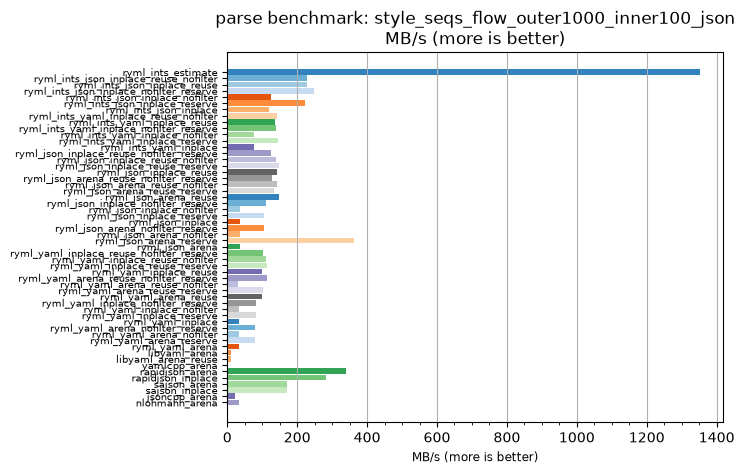
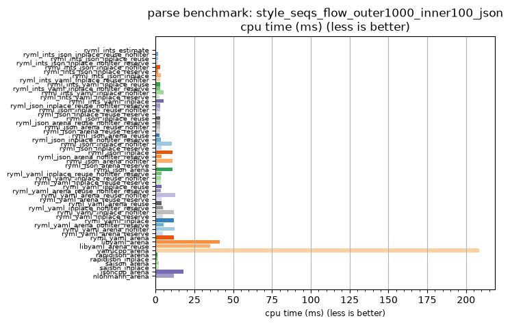

## parse benchmark: style_seqs_flow_outer1000_inner100_json

<p>Data type benchmark results:</p>
<ul>
   <li><pre><a href='#ryml-bm-parse-style_seqs_flow_outer1000_inner100_json-ryml_ints_estimate'>ryml_ints_estimate</a></pre></li> </ul>


<br/>
<br/>

---

<a id="ryml-bm-parse-style_seqs_flow_outer1000_inner100_json-ryml_ints_estimate"/>

### parse benchmark: style_seqs_flow_outer1000_inner100_json

* Interactive html graphs
  * [MB/s](./ryml-bm-parse-style_seqs_flow_outer1000_inner100_json-mega_bytes_per_second.html)
  * [CPU time](./ryml-bm-parse-style_seqs_flow_outer1000_inner100_json-cpu_time_ms.html)

[](./ryml-bm-parse-style_seqs_flow_outer1000_inner100_json-mega_bytes_per_second.png)
[](./ryml-bm-parse-style_seqs_flow_outer1000_inner100_json-cpu_time_ms.png)

```
+----------------------------------------------------------------------------------------------------------------------+
|                               parse benchmark: style_seqs_flow_outer1000_inner100_json                               |
+------------------------------------------+---------+---------+-----------+---------------+-------------+-------------+
| function                                 |    MB/s | MB/s(x) |   MB/s(%) | cpu time (ms) | cpu time(x) | cpu time(%) |
+------------------------------------------+---------+---------+-----------+---------------+-------------+-------------+
| ryml_ints_estimate                       | 1351.36 | 714.55x | 71354.55% |          0.29 |       0.00x |     -99.86% |
| ryml_ints_json_inplace_reuse_nofilter    |  228.07 | 120.59x | 11959.26% |          1.73 |       0.01x |     -99.17% |
| ryml_ints_json_inplace_reuse             |  228.07 | 120.59x | 11959.26% |          1.73 |       0.01x |     -99.17% |
| ryml_ints_json_inplace_nofilter_reserve  |  247.52 | 130.88x | 12987.72% |          1.59 |       0.01x |     -99.24% |
| ryml_ints_json_inplace_nofilter          |  124.91 |  66.05x |  6504.65% |          3.15 |       0.02x |     -98.49% |
| ryml_ints_json_inplace_reserve           |  221.51 | 117.12x | 11612.42% |          1.78 |       0.01x |     -99.15% |
| ryml_ints_json_inplace                   |  119.36 |  63.11x |  6211.11% |          3.30 |       0.02x |     -98.42% |
| ryml_ints_yaml_inplace_reuse_nofilter    |  141.64 |  74.89x |  7389.36% |          2.78 |       0.01x |     -98.66% |
| ryml_ints_yaml_inplace_reuse             |  136.50 |  72.17x |  7117.39% |          2.89 |       0.01x |     -98.61% |
| ryml_ints_yaml_inplace_nofilter_reserve  |  139.62 |  73.83x |  7282.72% |          2.82 |       0.01x |     -98.65% |
| ryml_ints_yaml_inplace_nofilter          |   76.41 |  40.40x |  3940.40% |          5.16 |       0.02x |     -97.52% |
| ryml_ints_yaml_inplace_reserve           |  144.72 |  76.52x |  7552.17% |          2.72 |       0.01x |     -98.69% |
| ryml_ints_yaml_inplace                   |   76.41 |  40.40x |  3940.40% |          5.16 |       0.02x |     -97.52% |
| ryml_json_inplace_reuse_nofilter_reserve |  125.52 |  66.37x |  6537.04% |          3.14 |       0.02x |     -98.49% |
| ryml_json_inplace_reuse_nofilter         |  139.53 |  73.78x |  7277.78% |          2.82 |       0.01x |     -98.64% |
| ryml_json_inplace_reuse_reserve          |  146.97 |  77.71x |  7671.43% |          2.68 |       0.01x |     -98.71% |
| ryml_json_inplace_reuse                  |  141.64 |  74.89x |  7389.36% |          2.78 |       0.01x |     -98.66% |
| ryml_json_arena_reuse_nofilter_reserve   |  128.14 |  67.76x |  6675.51% |          3.07 |       0.01x |     -98.52% |
| ryml_json_arena_reuse_nofilter           |  142.70 |  75.45x |  7445.45% |          2.76 |       0.01x |     -98.67% |
| ryml_json_arena_reuse_reserve            |  133.14 |  70.40x |  6940.00% |          2.96 |       0.01x |     -98.58% |
| ryml_json_arena_reuse                    |  147.94 |  78.22x |  7722.22% |          2.66 |       0.01x |     -98.72% |
| ryml_json_inplace_nofilter_reserve       |  111.37 |  58.89x |  5788.89% |          3.54 |       0.02x |     -98.30% |
| ryml_json_inplace_nofilter               |   37.53 |  19.84x |  1884.50% |         10.50 |       0.05x |     -94.96% |
| ryml_json_inplace_reserve                |  104.85 |  55.44x |  5443.86% |          3.76 |       0.02x |     -98.20% |
| ryml_json_inplace                        |   35.86 |  18.96x |  1796.30% |         10.99 |       0.05x |     -94.73% |
| ryml_json_arena_nofilter_reserve         |  104.37 |  55.19x |  5418.52% |          3.78 |       0.02x |     -98.19% |
| ryml_json_arena_nofilter                 |   35.86 |  18.96x |  1796.30% |         10.99 |       0.05x |     -94.73% |
| ryml_json_arena_reserve                  |  363.88 | 192.41x | 19140.51% |          1.08 |       0.01x |     -99.48% |
| ryml_json_arena                          |   35.86 |  18.96x |  1796.30% |         10.99 |       0.05x |     -94.73% |
| ryml_yaml_inplace_reuse_nofilter_reserve |  100.87 |  53.33x |  5233.33% |          3.91 |       0.02x |     -98.12% |
| ryml_yaml_inplace_reuse_nofilter         |  109.66 |  57.98x |  5698.45% |          3.59 |       0.02x |     -98.28% |
| ryml_yaml_inplace_reuse_reserve          |  112.27 |  59.37x |  5836.51% |          3.51 |       0.02x |     -98.32% |
| ryml_yaml_inplace_reuse                  |   98.24 |  51.94x |  5094.44% |          4.01 |       0.02x |     -98.07% |
| ryml_yaml_arena_reuse_nofilter_reserve   |  115.01 |  60.81x |  5981.30% |          3.43 |       0.02x |     -98.36% |
| ryml_yaml_arena_reuse_nofilter           |   31.38 |  16.59x |  1559.26% |         12.56 |       0.06x |     -93.97% |
| ryml_yaml_arena_reuse_reserve            |  102.88 |  54.40x |  5340.00% |          3.83 |       0.02x |     -98.16% |
| ryml_yaml_arena_reuse                    |  100.30 |  53.04x |  5203.70% |          3.93 |       0.02x |     -98.11% |
| ryml_yaml_inplace_nofilter_reserve       |   83.07 |  43.92x |  4292.16% |          4.74 |       0.02x |     -97.72% |
| ryml_yaml_inplace_nofilter               |   32.84 |  17.36x |  1636.43% |         12.00 |       0.06x |     -94.24% |
| ryml_yaml_inplace_reserve                |   81.25 |  42.96x |  4196.30% |          4.85 |       0.02x |     -97.67% |
| ryml_yaml_inplace                        |   32.84 |  17.36x |  1636.43% |         12.00 |       0.06x |     -94.24% |
| ryml_yaml_arena_nofilter_reserve         |   78.80 |  41.67x |  4066.67% |          5.00 |       0.02x |     -97.60% |
| ryml_yaml_arena_nofilter                 |   32.09 |  16.97x |  1596.97% |         12.28 |       0.06x |     -94.11% |
| ryml_yaml_arena_reserve                  |   80.69 |  42.67x |  4166.67% |          4.88 |       0.02x |     -97.66% |
| ryml_yaml_arena                          |   33.62 |  17.78x |  1677.78% |         11.72 |       0.06x |     -94.38% |
| libyaml_arena                            |    9.53 |   5.04x |   403.70% |         41.36 |       0.20x |     -80.15% |
| libyaml_arena_reuse                      |   11.14 |   5.89x |   489.15% |         35.36 |       0.17x |     -83.03% |
| yamlcpp_arena                            |    1.89 |   1.00x |     0.00% |        208.33 |       1.00x |       0.00% |
| rapidjson_arena                          |  339.40 | 179.46x | 17845.95% |          1.16 |       0.01x |     -99.44% |
| rapidjson_inplace                        |  282.42 | 149.33x | 14833.33% |          1.40 |       0.01x |     -99.33% |
| sajson_arena                             |  171.36 |  90.61x |  8960.61% |          2.30 |       0.01x |     -98.90% |
| sajson_inplace                           |  171.69 |  90.78x |  8978.01% |          2.29 |       0.01x |     -98.90% |
| jsoncpp_arena                            |   21.70 |  11.47x |  1047.29% |         18.16 |       0.09x |     -91.28% |
| nlohmann_arena                           |   32.94 |  17.41x |  1641.50% |         11.96 |       0.06x |     -94.26% |
+------------------------------------------+---------+---------+-----------+---------------+-------------+-------------+
```

