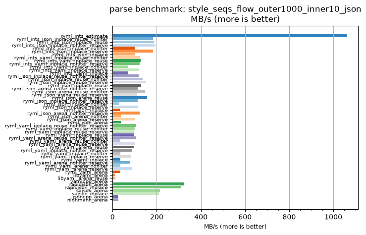
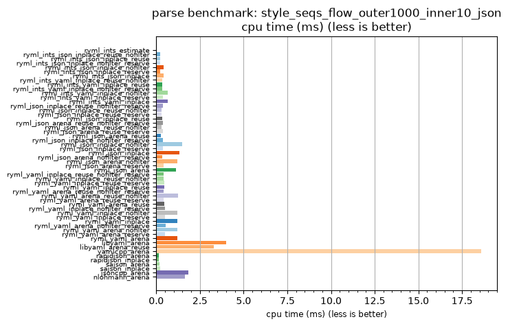

## parse benchmark: style_seqs_flow_outer1000_inner10_json

<p>Data type benchmark results:</p>
<ul>
   <li><pre><a href='#ryml-bm-parse-style_seqs_flow_outer1000_inner10_json-ryml_ints_estimate'>ryml_ints_estimate</a></pre></li> </ul>


<br/>
<br/>

---

<a id="ryml-bm-parse-style_seqs_flow_outer1000_inner10_json-ryml_ints_estimate"/>

### parse benchmark: style_seqs_flow_outer1000_inner10_json

* Interactive html graphs
  * [MB/s](./ryml-bm-parse-style_seqs_flow_outer1000_inner10_json-mega_bytes_per_second.html)
  * [CPU time](./ryml-bm-parse-style_seqs_flow_outer1000_inner10_json-cpu_time_ms.html)

[](./ryml-bm-parse-style_seqs_flow_outer1000_inner10_json-mega_bytes_per_second.png)
[](./ryml-bm-parse-style_seqs_flow_outer1000_inner10_json-cpu_time_ms.png)

```
+----------------------------------------------------------------------------------------------------------------------+
|                               parse benchmark: style_seqs_flow_outer1000_inner10_json                                |
+------------------------------------------+---------+---------+-----------+---------------+-------------+-------------+
| function                                 |    MB/s | MB/s(x) |   MB/s(%) | cpu time (ms) | cpu time(x) | cpu time(%) |
+------------------------------------------+---------+---------+-----------+---------------+-------------+-------------+
| ryml_ints_estimate                       | 1059.64 | 448.46x | 44745.95% |          0.04 |       0.00x |     -99.78% |
| ryml_ints_json_inplace_reuse_nofilter    |  182.46 |  77.22x |  7621.97% |          0.24 |       0.01x |     -98.70% |
| ryml_ints_json_inplace_reuse             |  187.32 |  79.28x |  7827.93% |          0.23 |       0.01x |     -98.74% |
| ryml_ints_json_inplace_nofilter_reserve  |  191.89 |  81.21x |  8021.29% |          0.23 |       0.01x |     -98.77% |
| ryml_ints_json_inplace_nofilter          |  103.59 |  43.84x |  4284.14% |          0.42 |       0.02x |     -97.72% |
| ryml_ints_json_inplace_reserve           |  182.97 |  77.44x |  7643.56% |          0.24 |       0.01x |     -98.71% |
| ryml_ints_json_inplace                   |  101.34 |  42.89x |  4188.84% |          0.43 |       0.02x |     -97.67% |
| ryml_ints_yaml_inplace_reuse_nofilter    |  124.37 |  52.63x |  5163.45% |          0.35 |       0.02x |     -98.10% |
| ryml_ints_yaml_inplace_reuse             |  127.29 |  53.87x |  5287.30% |          0.34 |       0.02x |     -98.14% |
| ryml_ints_yaml_inplace_nofilter_reserve  |  121.72 |  51.51x |  5051.47% |          0.36 |       0.02x |     -98.06% |
| ryml_ints_yaml_inplace_nofilter          |   68.41 |  28.95x |  2795.42% |          0.64 |       0.03x |     -96.55% |
| ryml_ints_yaml_inplace_reserve           |  118.99 |  50.36x |  4935.96% |          0.37 |       0.02x |     -98.01% |
| ryml_ints_yaml_inplace                   |   68.41 |  28.95x |  2795.42% |          0.64 |       0.03x |     -96.55% |
| ryml_json_inplace_reuse_nofilter_reserve |  117.52 |  49.74x |  4873.61% |          0.37 |       0.02x |     -97.99% |
| ryml_json_inplace_reuse_nofilter         |  136.83 |  57.91x |  5690.83% |          0.32 |       0.02x |     -98.27% |
| ryml_json_inplace_reuse_reserve          |  152.04 |  64.35x |  6334.55% |          0.29 |       0.02x |     -98.45% |
| ryml_json_inplace_reuse                  |  129.11 |  54.64x |  5364.17% |          0.34 |       0.02x |     -98.17% |
| ryml_json_arena_reuse_nofilter_reserve   |  114.44 |  48.43x |  4743.24% |          0.38 |       0.02x |     -97.94% |
| ryml_json_arena_reuse_nofilter           |  147.24 |  62.31x |  6131.35% |          0.30 |       0.02x |     -98.40% |
| ryml_json_arena_reuse_reserve            |  112.30 |  47.53x |  4652.73% |          0.39 |       0.02x |     -97.90% |
| ryml_json_arena_reuse                    |  156.39 |  66.19x |  6518.69% |          0.28 |       0.02x |     -98.49% |
| ryml_json_inplace_nofilter_reserve       |  114.44 |  48.43x |  4743.24% |          0.38 |       0.02x |     -97.94% |
| ryml_json_inplace_nofilter               |   29.77 |  12.60x |  1160.03% |          1.47 |       0.08x |     -92.06% |
| ryml_json_inplace_reserve                |  117.10 |  49.56x |  4855.88% |          0.37 |       0.02x |     -97.98% |
| ryml_json_inplace                        |   33.32 |  14.10x |  1310.04% |          1.32 |       0.07x |     -92.91% |
| ryml_json_arena_nofilter_reserve         |  122.81 |  51.98x |  5097.63% |          0.36 |       0.02x |     -98.08% |
| ryml_json_arena_nofilter                 |   36.59 |  15.49x |  1448.71% |          1.20 |       0.06x |     -93.54% |
| ryml_json_arena_reserve                  |  103.28 |  43.71x |  4270.83% |          0.43 |       0.02x |     -97.71% |
| ryml_json_arena                          |   38.26 |  16.19x |  1519.32% |          1.15 |       0.06x |     -93.82% |
| ryml_yaml_inplace_reuse_nofilter_reserve |  107.04 |  45.30x |  4430.24% |          0.41 |       0.02x |     -97.79% |
| ryml_yaml_inplace_reuse_nofilter         |  101.34 |  42.89x |  4188.84% |          0.43 |       0.02x |     -97.67% |
| ryml_yaml_inplace_reuse_reserve          |   98.73 |  41.78x |  4078.48% |          0.44 |       0.02x |     -97.61% |
| ryml_yaml_inplace_reuse                  |   95.34 |  40.35x |  3935.14% |          0.46 |       0.02x |     -97.52% |
| ryml_yaml_arena_reuse_nofilter_reserve   |  107.94 |  45.68x |  4468.28% |          0.41 |       0.02x |     -97.81% |
| ryml_yaml_arena_reuse_nofilter           |   34.98 |  14.81x |  1380.54% |          1.26 |       0.07x |     -93.25% |
| ryml_yaml_arena_reuse_reserve            |  100.96 |  42.73x |  4172.78% |          0.43 |       0.02x |     -97.66% |
| ryml_yaml_arena_reuse                    |   95.36 |  40.36x |  3936.04% |          0.46 |       0.02x |     -97.52% |
| ryml_yaml_inplace_nofilter_reserve       |   87.81 |  37.16x |  3616.22% |          0.50 |       0.03x |     -97.31% |
| ryml_yaml_inplace_nofilter               |   35.76 |  15.14x |  1413.51% |          1.23 |       0.07x |     -93.39% |
| ryml_yaml_inplace_reserve                |   85.15 |  36.04x |  3503.60% |          0.52 |       0.03x |     -97.22% |
| ryml_yaml_inplace                        |   35.76 |  15.14x |  1413.51% |          1.23 |       0.07x |     -93.39% |
| ryml_yaml_arena_nofilter_reserve         |   80.28 |  33.98x |  3297.68% |          0.55 |       0.03x |     -97.06% |
| ryml_yaml_arena_nofilter                 |   35.76 |  15.14x |  1413.51% |          1.23 |       0.07x |     -93.39% |
| ryml_yaml_arena_reserve                  |   87.81 |  37.16x |  3616.22% |          0.50 |       0.03x |     -97.31% |
| ryml_yaml_arena                          |   35.76 |  15.14x |  1413.51% |          1.23 |       0.07x |     -93.39% |
| libyaml_arena                            |   10.98 |   4.65x |   364.86% |          4.00 |       0.22x |     -78.49% |
| libyaml_arena_reuse                      |   13.39 |   5.67x |   466.76% |          3.28 |       0.18x |     -82.36% |
| yamlcpp_arena                            |    2.36 |   1.00x |     0.00% |         18.58 |       1.00x |       0.00% |
| rapidjson_arena                          |  325.29 | 137.67x | 13666.94% |          0.13 |       0.01x |     -99.27% |
| rapidjson_inplace                        |  310.83 | 131.55x | 13055.08% |          0.14 |       0.01x |     -99.24% |
| sajson_arena                             |  215.17 |  91.07x |  9006.55% |          0.20 |       0.01x |     -98.90% |
| sajson_inplace                           |  210.49 |  89.09x |  8808.58% |          0.21 |       0.01x |     -98.88% |
| jsoncpp_arena                            |   23.83 |  10.08x |   908.33% |          1.84 |       0.10x |     -90.08% |
| nlohmann_arena                           |   26.60 |  11.26x |  1025.58% |          1.65 |       0.09x |     -91.12% |
+------------------------------------------+---------+---------+-----------+---------------+-------------+-------------+
```

