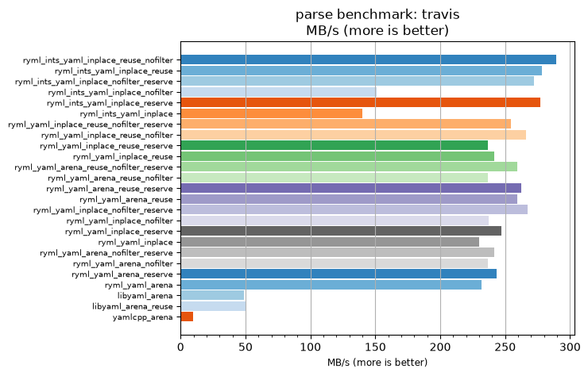
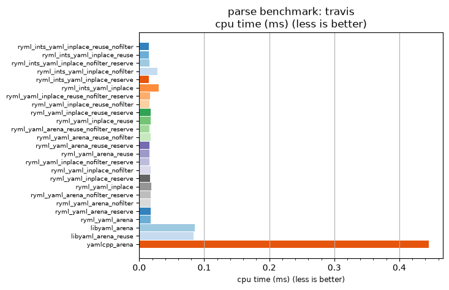

## parse benchmark: travis

<p>Data type benchmark results:</p>
<ul>
   <li><pre><a href='#ryml-bm-parse-travis-ryml_ints_yaml_inplace_reuse_nofilter'>ryml_ints_yaml_inplace_reuse_nofilter</a></pre></li> </ul>


<br/>
<br/>

---

<a id="ryml-bm-parse-travis-ryml_ints_yaml_inplace_reuse_nofilter"/>

### parse benchmark: travis

* Interactive html graphs
  * [MB/s](./ryml-bm-parse-travis-mega_bytes_per_second.html)
  * [CPU time](./ryml-bm-parse-travis-cpu_time_ms.html)

[](./ryml-bm-parse-travis-mega_bytes_per_second.png)
[](./ryml-bm-parse-travis-cpu_time_ms.png)

```
+---------------------------------------------------------------------------------------------------------------------+
|                                               parse benchmark: travis                                               |
+------------------------------------------+---------+---------+----------+---------------+-------------+-------------+
| function                                 |    MB/s | MB/s(x) |  MB/s(%) | cpu time (ms) | cpu time(x) | cpu time(%) |
+------------------------------------------+---------+---------+----------+---------------+-------------+-------------+
| ryml_ints_yaml_inplace_reuse_nofilter    |  289.15 |  30.82x | 2981.80% |          0.01 |       0.03x |     -96.76% |
| ryml_ints_yaml_inplace_reuse             |  278.39 |  29.67x | 2867.11% |          0.01 |       0.03x |     -96.63% |
| ryml_ints_yaml_inplace_nofilter_reserve  |  272.06 |  29.00x | 2799.66% |          0.02 |       0.03x |     -96.55% |
| ryml_ints_yaml_inplace_nofilter          |  151.14 |  16.11x | 1510.94% |          0.03 |       0.06x |     -93.79% |
| ryml_ints_yaml_inplace_reserve           |  277.10 |  29.53x | 2853.37% |          0.02 |       0.03x |     -96.61% |
| ryml_ints_yaml_inplace                   |  140.01 |  14.92x | 1392.23% |          0.03 |       0.07x |     -93.30% |
| ryml_yaml_inplace_reuse_nofilter_reserve |  254.69 |  27.15x | 2614.59% |          0.02 |       0.04x |     -96.32% |
| ryml_yaml_inplace_reuse_nofilter         |  266.01 |  28.35x | 2735.25% |          0.02 |       0.04x |     -96.47% |
| ryml_yaml_inplace_reuse_reserve          |  236.57 |  25.21x | 2421.44% |          0.02 |       0.04x |     -96.03% |
| ryml_yaml_inplace_reuse                  |  241.83 |  25.77x | 2477.47% |          0.02 |       0.04x |     -96.12% |
| ryml_yaml_arena_reuse_nofilter_reserve   |  259.10 |  27.62x | 2661.58% |          0.02 |       0.04x |     -96.38% |
| ryml_yaml_arena_reuse_nofilter           |  236.57 |  25.21x | 2421.44% |          0.02 |       0.04x |     -96.03% |
| ryml_yaml_arena_reuse_reserve            |  262.51 |  27.98x | 2697.91% |          0.02 |       0.04x |     -96.43% |
| ryml_yaml_arena_reuse                    |  259.10 |  27.62x | 2661.58% |          0.02 |       0.04x |     -96.38% |
| ryml_yaml_inplace_nofilter_reserve       |  267.20 |  28.48x | 2747.90% |          0.02 |       0.04x |     -96.49% |
| ryml_yaml_inplace_nofilter               |  237.51 |  25.31x | 2431.44% |          0.02 |       0.04x |     -96.05% |
| ryml_yaml_inplace_reserve                |  247.32 |  26.36x | 2536.05% |          0.02 |       0.04x |     -96.21% |
| ryml_yaml_inplace                        |  230.20 |  24.54x | 2353.57% |          0.02 |       0.04x |     -95.92% |
| ryml_yaml_arena_nofilter_reserve         |  241.83 |  25.77x | 2477.47% |          0.02 |       0.04x |     -96.12% |
| ryml_yaml_arena_nofilter                 |  236.57 |  25.21x | 2421.44% |          0.02 |       0.04x |     -96.03% |
| ryml_yaml_arena_reserve                  |  243.30 |  25.93x | 2493.18% |          0.02 |       0.04x |     -96.14% |
| ryml_yaml_arena                          |  231.54 |  24.68x | 2367.79% |          0.02 |       0.04x |     -95.95% |
| libyaml_arena                            |   48.66 |   5.19x |  418.66% |          0.09 |       0.19x |     -80.72% |
| libyaml_arena_reuse                      |   49.88 |   5.32x |  431.63% |          0.08 |       0.19x |     -81.19% |
| yamlcpp_arena                            |    9.38 |   1.00x |    0.00% |          0.44 |       1.00x |       0.00% |
+------------------------------------------+---------+---------+----------+---------------+-------------+-------------+
```

