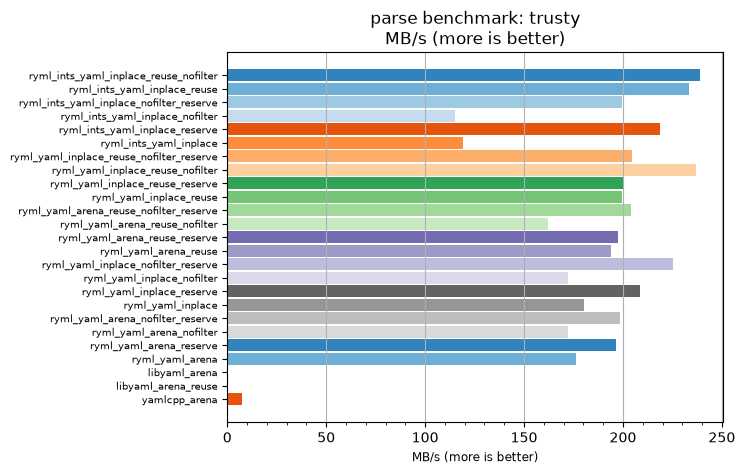
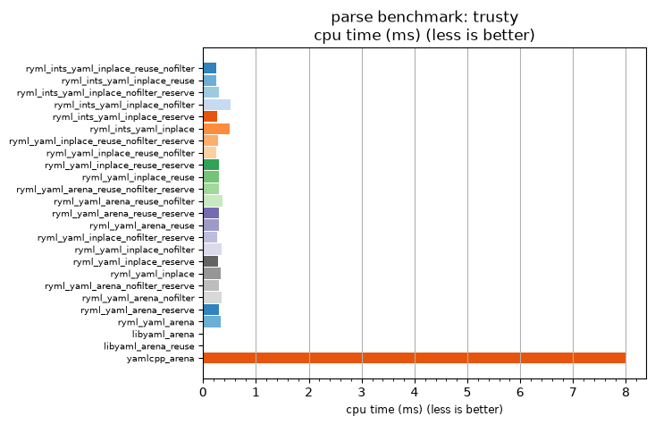

## parse benchmark: trusty

<p>Data type benchmark results:</p>
<ul>
   <li><pre><a href='#ryml-bm-parse-trusty-ryml_ints_yaml_inplace_reuse_nofilter'>ryml_ints_yaml_inplace_reuse_nofilter</a></pre></li> </ul>


<br/>
<br/>

---

<a id="ryml-bm-parse-trusty-ryml_ints_yaml_inplace_reuse_nofilter"/>

### parse benchmark: trusty

* Interactive html graphs
  * [MB/s](./ryml-bm-parse-trusty-mega_bytes_per_second.html)
  * [CPU time](./ryml-bm-parse-trusty-cpu_time_ms.html)

[](./ryml-bm-parse-trusty-mega_bytes_per_second.png)
[](./ryml-bm-parse-trusty-cpu_time_ms.png)

```
+---------------------------------------------------------------------------------------------------------------------+
|                                               parse benchmark: trusty                                               |
+------------------------------------------+---------+---------+----------+---------------+-------------+-------------+
| function                                 |    MB/s | MB/s(x) |  MB/s(%) | cpu time (ms) | cpu time(x) | cpu time(%) |
+------------------------------------------+---------+---------+----------+---------------+-------------+-------------+
| ryml_ints_yaml_inplace_reuse_nofilter    |  238.77 |  32.07x | 3106.61% |          0.25 |       0.03x |     -96.88% |
| ryml_ints_yaml_inplace_reuse             |  233.22 |  31.32x | 3032.04% |          0.25 |       0.03x |     -96.81% |
| ryml_ints_yaml_inplace_nofilter_reserve  |  199.43 |  26.78x | 2578.22% |          0.30 |       0.04x |     -96.27% |
| ryml_ints_yaml_inplace_nofilter          |  115.33 |  15.49x | 1448.82% |          0.52 |       0.06x |     -93.54% |
| ryml_ints_yaml_inplace_reserve           |  218.88 |  29.40x | 2839.51% |          0.27 |       0.03x |     -96.60% |
| ryml_ints_yaml_inplace                   |  118.93 |  15.97x | 1497.22% |          0.50 |       0.06x |     -93.74% |
| ryml_yaml_inplace_reuse_nofilter_reserve |  204.66 |  27.49x | 2648.53% |          0.29 |       0.04x |     -96.36% |
| ryml_yaml_inplace_reuse_nofilter         |  236.82 |  31.80x | 3080.39% |          0.25 |       0.03x |     -96.86% |
| ryml_yaml_inplace_reuse_reserve          |  200.57 |  26.94x | 2593.56% |          0.30 |       0.04x |     -96.29% |
| ryml_yaml_inplace_reuse                  |  199.43 |  26.78x | 2578.22% |          0.30 |       0.04x |     -96.27% |
| ryml_yaml_arena_reuse_nofilter_reserve   |  203.96 |  27.39x | 2639.09% |          0.29 |       0.04x |     -96.35% |
| ryml_yaml_arena_reuse_nofilter           |  162.36 |  21.80x | 2080.40% |          0.37 |       0.05x |     -95.41% |
| ryml_yaml_arena_reuse_reserve            |  197.35 |  26.50x | 2550.32% |          0.30 |       0.04x |     -96.23% |
| ryml_yaml_arena_reuse                    |  193.75 |  26.02x | 2502.02% |          0.31 |       0.04x |     -96.16% |
| ryml_yaml_inplace_nofilter_reserve       |  225.50 |  30.28x | 2928.33% |          0.26 |       0.03x |     -96.70% |
| ryml_yaml_inplace_nofilter               |  172.20 |  23.12x | 2212.49% |          0.35 |       0.04x |     -95.68% |
| ryml_yaml_inplace_reserve                |  208.70 |  28.03x | 2702.79% |          0.28 |       0.04x |     -96.43% |
| ryml_yaml_inplace                        |  180.20 |  24.20x | 2320.05% |          0.33 |       0.04x |     -95.87% |
| ryml_yaml_arena_nofilter_reserve         |  198.26 |  26.63x | 2562.53% |          0.30 |       0.04x |     -96.24% |
| ryml_yaml_arena_nofilter                 |  172.42 |  23.15x | 2215.45% |          0.34 |       0.04x |     -95.68% |
| ryml_yaml_arena_reserve                  |  196.64 |  26.41x | 2540.74% |          0.30 |       0.04x |     -96.21% |
| ryml_yaml_arena                          |  176.11 |  23.65x | 2265.05% |          0.34 |       0.04x |     -95.77% |
| libyaml_arena                            |    0.00 |   0.00x | -100.00% |          0.00 |       0.00x |    -100.00% |
| libyaml_arena_reuse                      |    0.00 |   0.00x | -100.00% |          0.00 |       0.00x |    -100.00% |
| yamlcpp_arena                            |    7.45 |   1.00x |    0.00% |          7.99 |       1.00x |       0.00% |
+------------------------------------------+---------+---------+----------+---------------+-------------+-------------+
```

