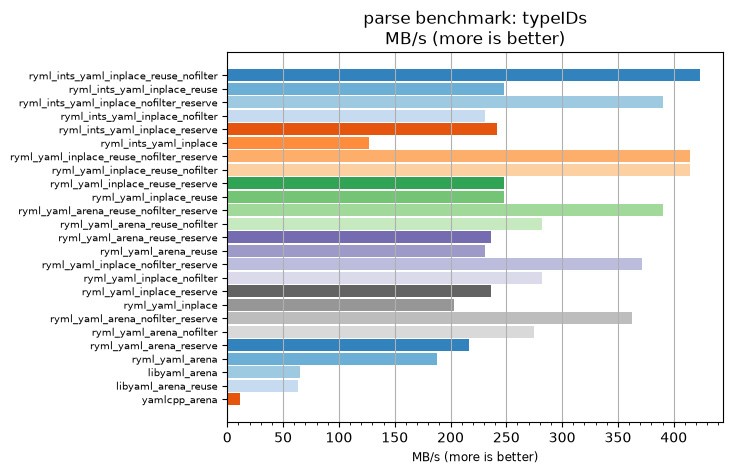
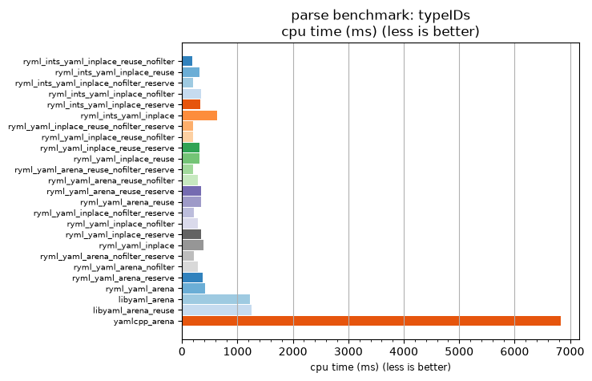

## parse benchmark: typeIDs

<p>Data type benchmark results:</p>
<ul>
   <li><pre><a href='#ryml-bm-parse-typeIDs-ryml_ints_yaml_inplace_reuse_nofilter'>ryml_ints_yaml_inplace_reuse_nofilter</a></pre></li> </ul>


<br/>
<br/>

---

<a id="ryml-bm-parse-typeIDs-ryml_ints_yaml_inplace_reuse_nofilter"/>

### parse benchmark: typeIDs

* Interactive html graphs
  * [MB/s](./ryml-bm-parse-typeIDs-mega_bytes_per_second.html)
  * [CPU time](./ryml-bm-parse-typeIDs-cpu_time_ms.html)

[](./ryml-bm-parse-typeIDs-mega_bytes_per_second.png)
[](./ryml-bm-parse-typeIDs-cpu_time_ms.png)

```
+---------------------------------------------------------------------------------------------------------------------+
|                                               parse benchmark: typeIDs                                              |
+------------------------------------------+---------+---------+----------+---------------+-------------+-------------+
| function                                 |    MB/s | MB/s(x) |  MB/s(%) | cpu time (ms) | cpu time(x) | cpu time(%) |
+------------------------------------------+---------+---------+----------+---------------+-------------+-------------+
| ryml_ints_yaml_inplace_reuse_nofilter    |  423.24 |  36.42x | 3541.67% |        187.50 |       0.03x |     -97.25% |
| ryml_ints_yaml_inplace_reuse             |  247.75 |  21.32x | 2031.71% |        320.31 |       0.05x |     -95.31% |
| ryml_ints_yaml_inplace_nofilter_reserve  |  390.68 |  33.62x | 3261.54% |        203.12 |       0.03x |     -97.03% |
| ryml_ints_yaml_inplace_nofilter          |  230.86 |  19.86x | 1886.36% |        343.75 |       0.05x |     -94.97% |
| ryml_ints_yaml_inplace_reserve           |  241.85 |  20.81x | 1980.95% |        328.12 |       0.05x |     -95.19% |
| ryml_ints_yaml_inplace                   |  126.97 |  10.93x |  992.50% |        625.00 |       0.09x |     -90.85% |
| ryml_yaml_inplace_reuse_nofilter_reserve |  414.60 |  35.67x | 3467.35% |        191.41 |       0.03x |     -97.20% |
| ryml_yaml_inplace_reuse_nofilter         |  414.60 |  35.67x | 3467.35% |        191.41 |       0.03x |     -97.20% |
| ryml_yaml_inplace_reuse_reserve          |  247.75 |  21.32x | 2031.71% |        320.31 |       0.05x |     -95.31% |
| ryml_yaml_inplace_reuse                  |  247.75 |  21.32x | 2031.71% |        320.31 |       0.05x |     -95.31% |
| ryml_yaml_arena_reuse_nofilter_reserve   |  390.68 |  33.62x | 3261.54% |        203.12 |       0.03x |     -97.03% |
| ryml_yaml_arena_reuse_nofilter           |  282.16 |  24.28x | 2327.78% |        281.25 |       0.04x |     -95.88% |
| ryml_yaml_arena_reuse_reserve            |  236.22 |  20.33x | 1932.56% |        335.94 |       0.05x |     -95.08% |
| ryml_yaml_arena_reuse                    |  230.86 |  19.86x | 1886.36% |        343.75 |       0.05x |     -94.97% |
| ryml_yaml_inplace_nofilter_reserve       |  371.62 |  31.98x | 3097.56% |        213.54 |       0.03x |     -96.87% |
| ryml_yaml_inplace_nofilter               |  282.16 |  24.28x | 2327.78% |        281.25 |       0.04x |     -95.88% |
| ryml_yaml_inplace_reserve                |  236.22 |  20.33x | 1932.56% |        335.94 |       0.05x |     -95.08% |
| ryml_yaml_inplace                        |  203.15 |  17.48x | 1648.00% |        390.62 |       0.06x |     -94.28% |
| ryml_yaml_arena_nofilter_reserve         |  362.77 |  31.21x | 3021.43% |        218.75 |       0.03x |     -96.80% |
| ryml_yaml_arena_nofilter                 |  274.53 |  23.62x | 2262.16% |        289.06 |       0.04x |     -95.77% |
| ryml_yaml_arena_reserve                  |  216.12 |  18.60x | 1759.57% |        367.19 |       0.05x |     -94.62% |
| ryml_yaml_arena                          |  188.10 |  16.19x | 1518.52% |        421.88 |       0.06x |     -93.82% |
| libyaml_arena                            |   65.11 |   5.60x |  460.26% |       1218.75 |       0.18x |     -82.15% |
| libyaml_arena_reuse                      |   63.49 |   5.46x |  446.25% |       1250.00 |       0.18x |     -81.69% |
| yamlcpp_arena                            |   11.62 |   1.00x |    0.00% |       6828.12 |       1.00x |       0.00% |
+------------------------------------------+---------+---------+----------+---------------+-------------+-------------+
```

